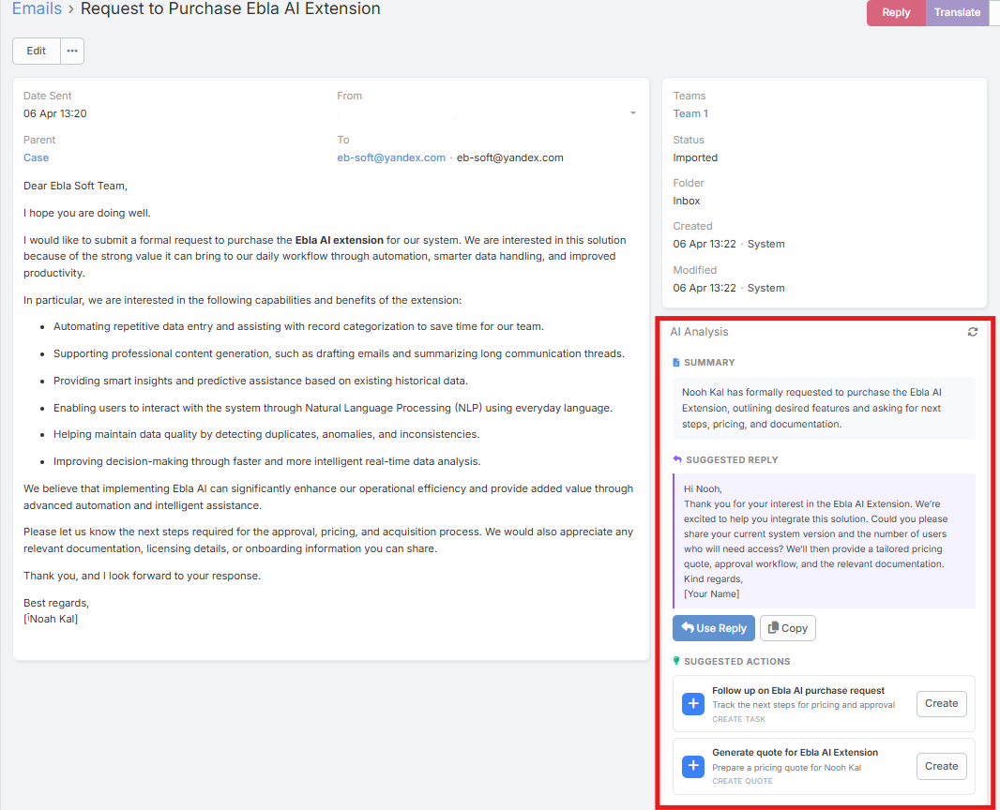

# Email Analysis Panel

The Email Analysis panel appears on Email detail views and shows an AI-generated breakdown of the email thread.

## Requirements

Users need:

- `Ai` access
- Read access to Email
- A configured default AI provider

## How It Loads

When the panel opens, it first checks for an existing cached analysis.

Current behavior:

- If a cached analysis exists, it is displayed immediately
- If no cached analysis exists, the panel stays empty until the user clicks the Analyze Email button

## Sections Shown in the Panel

The panel currently shows up to four sections:

### Summary

A concise overview of the thread.

### Action Items

Structured action items extracted from the conversation.

### Suggested Reply

A ready-to-edit reply draft with:

- **Use Reply** opens the compose modal with the suggested reply inserted above the original thread
- **Copy**

### Suggested Actions

Suggested CRM actions presented as clickable cards, such as:

- Create a related record
- Update a related record
- Post a note to the stream

## What It Analyzes

The analysis is based on the full thread context, not just the currently opened email body.

## Re-analyzing

Use the refresh icon in the panel header when:

- A new reply has arrived
- The thread changed
- You want to regenerate the analysis

## Related Features

- [AI Email Composer](email-compose.md)
- [Email Reply](email-reply.md)
- [AI Log](ai-log.md)
