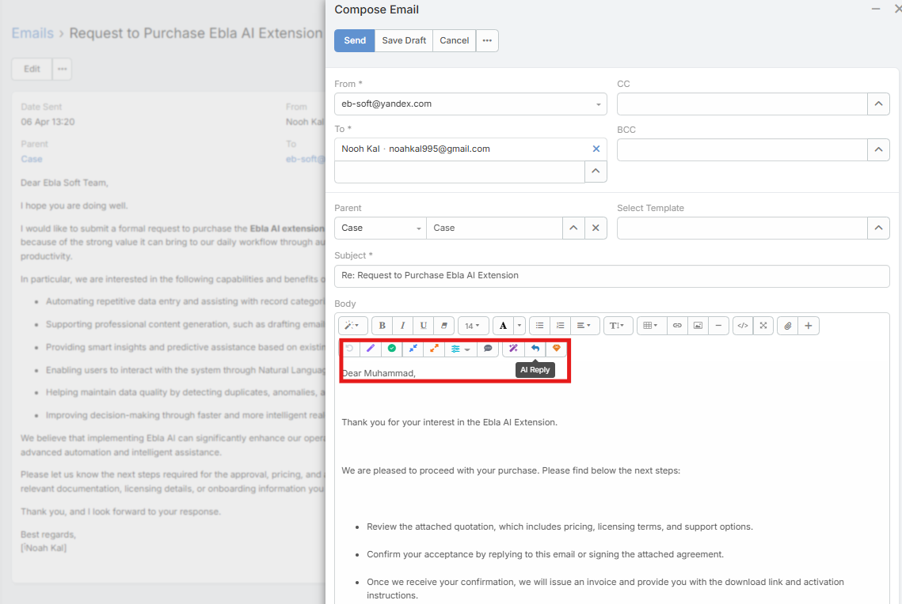
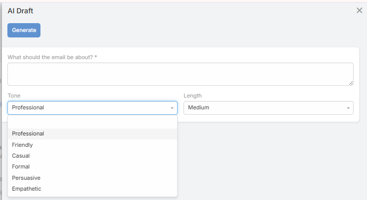

# Email Composer AI Toolbar

The Email Composer AI Toolbar adds AI actions directly inside the email editor for compose and reply workflows.

In the current UI, the toolbar exposes three main actions:

- **AI Draft**
- **AI Reply**
- **AI Polish**

## Requirements

Users need:

- `Ai` access
- `Ai Email Composer` access
- A configured default AI provider

The buttons can appear in both HTML and plain-text composer modes.

## AI Draft

**AI Draft** is the guided drafting flow for writing a new email from scratch.

1. Click **AI Draft**.
2. Enter what the email should be about.
3. Optionally choose:
   - **Tone**
   - **Length**
4. Click **Generate**.
5. Review the generated preview.
6. Click **Use This** to insert it into the editor.

## AI Reply

**AI Reply** generates a reply directly from the current email context.

Current behavior:

- No prompt dialog is shown
- The action reads the current body and sender context
- The generated reply is inserted above the existing thread

This makes it useful for quick first-pass replies.

## AI Polish

**AI Polish** improves the user's draft text.

Important behavior:

- It rewrites only the draft portion
- It does not rewrite the quoted thread below the reply
- The quoted thread is preserved and re-appended automatically

## Undo

The composer keeps an undo stack for AI actions.

Current behavior:

- The previous body is stored before each successful AI action
- Undo works across draft, reply, and polish
- Undo is session-only and is not saved across refreshes

## Plain-Text Mode

When the email is not HTML, Ebla AI adds a small button row above the textarea with the same main actions:

- **AI Draft**
- **AI Reply**
- **AI Polish**
- **Undo**

## Notes

- The language used by generated output follows the resolved user or system language context
- The profile used is the configured **AI Email Composer Default Profile** when set

## Related Features

- [Email Reply](email-reply.md)
- [Email Translation](email-translation.md)
- [AI Profiles](ai-profiles.md)
