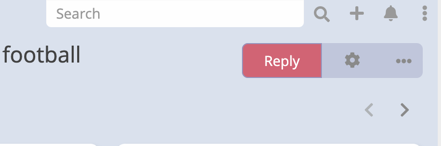
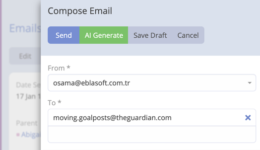
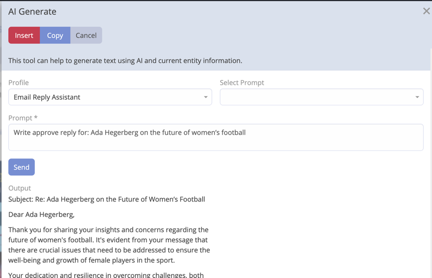

# Email Reply

By using this feature you can generate and refine a proper email reply. The AI will generate a reply based on the
context and the prompt you provide.

## Creating an Email Reply

1. Navigate to the Email you want to reply to it.
2. Click **Reply**.

   

3. Click **AI Generate**.

   

4. Select Profile "Email Reply Assistant".
5. Enter the prompt context or select it from predefined prompts.

   

6. Click **Send**.
7. The AI will generate a reply based on the context and the prompt you provided.
    - You can Press **Insert** to insert the generated reply into the email body.
    - You can Press **Copy** to copy the generated reply to the clipboard.

!!! important

    If output is not as expected, you can click on **Send** button to regenerate the output.

## Undo Stack

Every AI action performed in the email composer (draft, reply, polish, grammar, tone) saves the previous email body before making changes. This allows you to step back through multiple AI edits without losing your original content.

### Using Undo

- After the first AI action, an **Undo** button appears in the email toolbar.
- The button tooltip shows how many steps are available, for example: "Undo (3 steps)".
- Click **Undo** to restore the previous version of the email body.
- Continue clicking to step back through all saved versions.

### Notes

- The undo stack supports unlimited steps — every AI action adds a new entry.
- The undo button is disabled until at least one AI action has been performed in the current session.
- The undo stack is not persisted across page refreshes — it is only available during the current editing session.
- Undo works for both HTML (rich text / Summernote) and plain-text email modes.