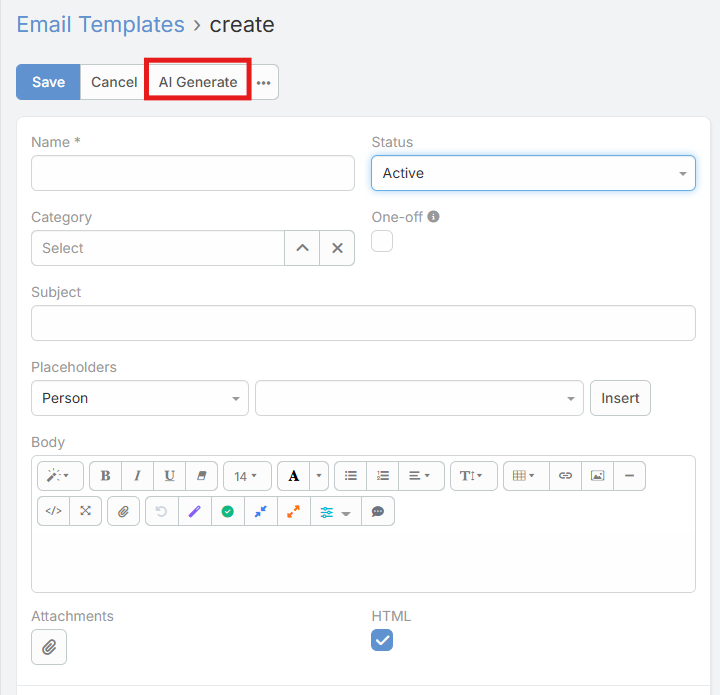
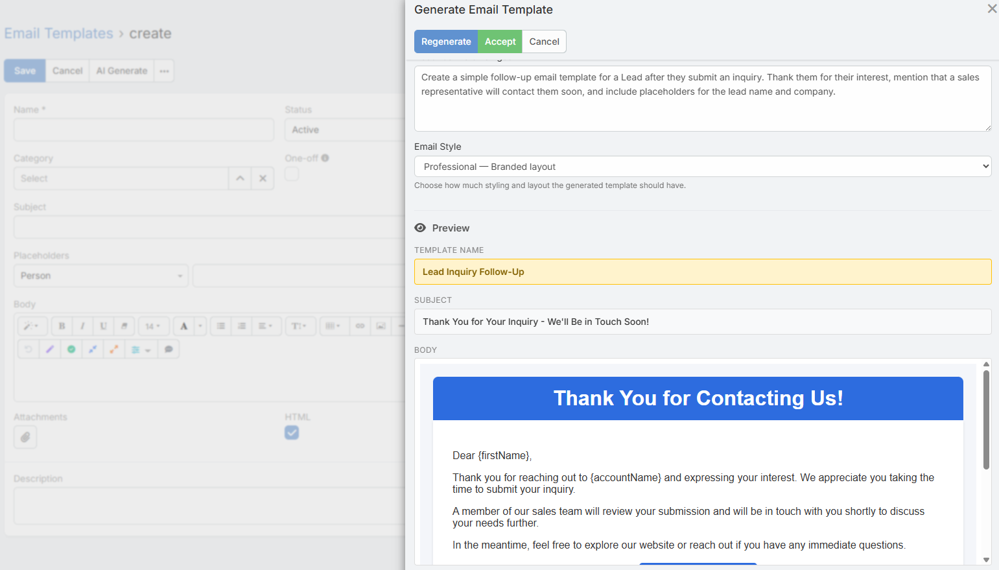
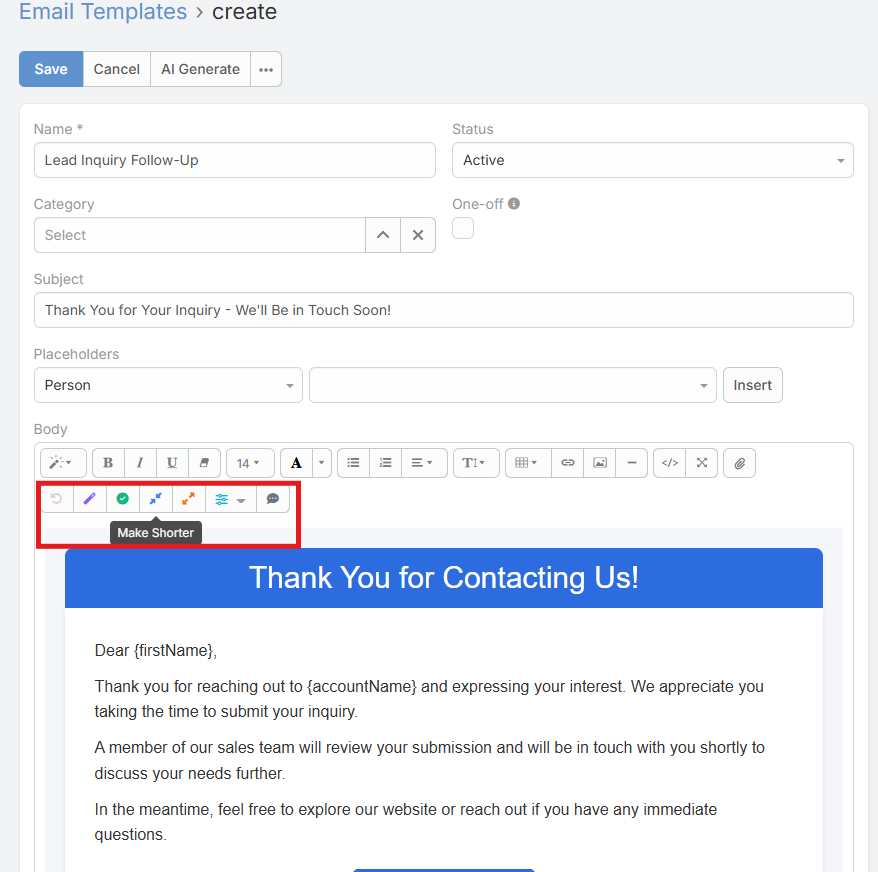

# AI Email Template Generator

This page covers the AI generation flow inside the Email Template form itself.

## Requirements

Users need:

- `Ai` access
- A configured default AI provider

## Where to Find It

1. Open an Email Template create or edit form.
2. Click the **AI Generate** button in the form dropdown list.

## Modal Behavior

The form-level generator opens the same core generation modal, but it respects the current template form state.

Current behavior:

- It starts with the current template entity type when available
- It respects the template `Is HTML` setting
- It does not expose a profile selector in the current UI

## What Gets Filled

After you click **Accept**, the form is updated with:

- **Name** if it is currently empty
- **Subject**
- **Body**

For plain-text templates, the generated content is applied as plain body text.

For HTML templates, the generated HTML is applied to the WYSIWYG body field.

## HTML vs Plain Text

### HTML Template

When the template is HTML:

- The style selector is shown in the modal
- The preview is rendered as HTML
- The accepted output fills the HTML body

### Plain-Text Template

When the template is not HTML:

- The style selector is hidden
- The output is treated as plain text

## Body Field AI Toolbar

The Email Template body field also has its own lightweight AI refinement toolbar.

Current actions:

- **Improve**
- **Fix Grammar**
- **Make Shorter**

## Notes

- The list-view generator and form-level generator are related but slightly different entry points
- The list-view flow always starts a new template creation flow
- The form-level flow is better when you are already editing a template and want the AI result inserted directly

## Related Features

- [Email Template Generation](email-template.md)
- [AI Prompts](ai-prompts.md)
- [AI Profiles](ai-profiles.md)
