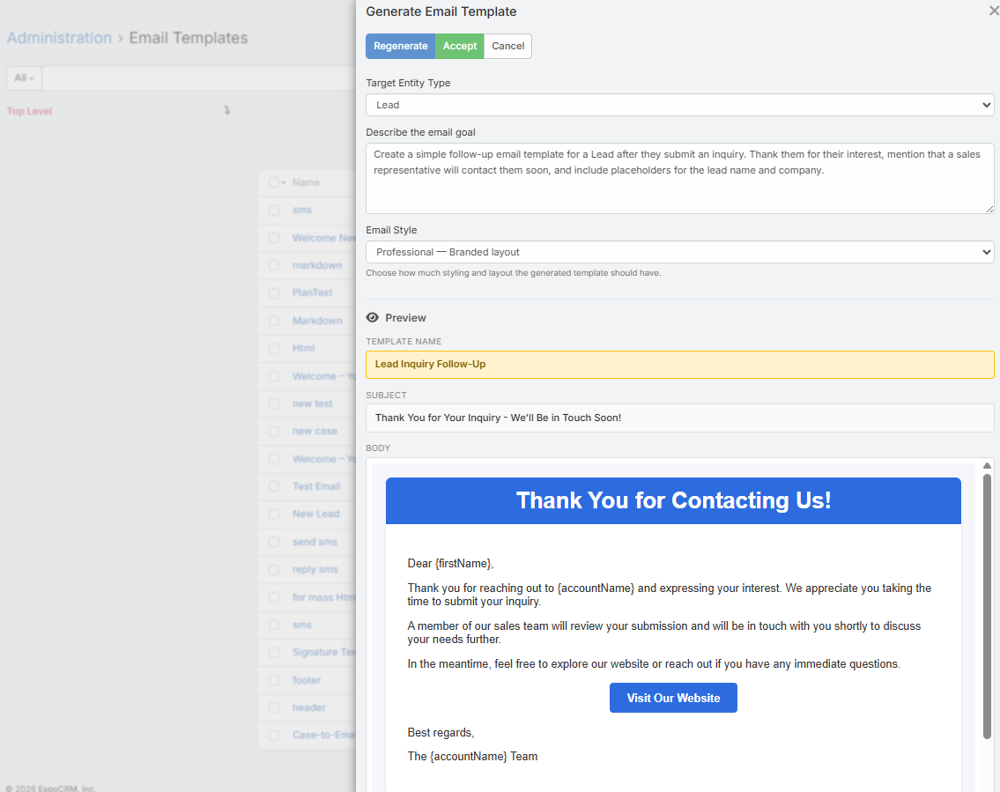

# Email Template Generation

This page covers the list-view AI flow for creating a new Email Template from a description.

## Requirements

Users need:

- `Ai` access
- Create access to `EmailTemplate`
- A configured default AI provider

## Where to Find It

1. Open **Email Templates**.
2. Click **Generate Email Template** in the list view.

## Modal Fields

The current list-view modal includes:

- **Description**
- **Entity Type**
- **Style**

The style selector is used for HTML template generation.

Available styles:

- `plain`
- `simple`
- `professional`
- `rich`
- `newsletter`

## Current Flow

1. Open the modal from the Email Template list.
2. Enter a description.
3. Optionally choose an entity type.
4. Choose a style.
5. Click **Generate**.
6. Review the preview.
7. Click **Accept**.
8. Ebla AI opens the Email Template create form pre-filled with:
   - Name
   - Subject
   - Body

## Important Note

The list-view flow creates a new HTML template draft.

It does not expose a profile selector in the current modal.

## Placeholder Behavior

The selected entity type helps the AI use the correct EspoCRM placeholders for the template.

Always review the final placeholders before saving.

## Tips

- Be specific about audience, purpose, tone, and call to action
- Choose the entity type that matches how the template will be used
- Use the preview to verify layout and placeholder usage before accepting

## Related Features

- [AI Email Template Generator](email-template-generator.md)
- [Email Composer AI Toolbar](email-composer.md)
