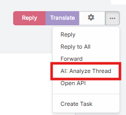
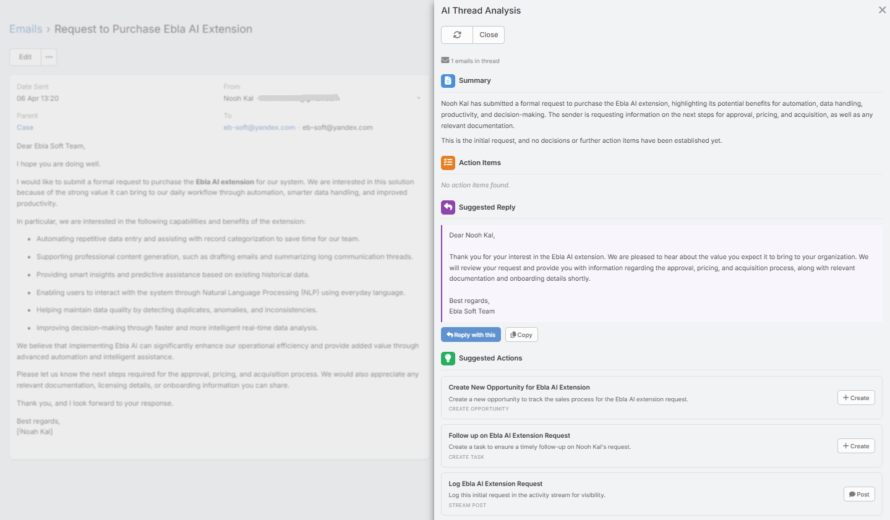

# Email Thread Analysis

Email Thread Analysis is the larger modal-based analysis view available from the Email detail page dropdown menu.

It uses the same backend analysis as the side panel, but presents the result in a dedicated modal with additional thread coverage details.

## How to Open It

1. Open an Email record.
2. Open the detail-view dropdown menu.
3. Click **Analyze Thread with AI**.

## Requirements

Users need:

- `Ai` access
- Read access to Email
- A configured default AI provider

## What the Modal Shows

The modal can include:

- **Summary**
- **Action Items**
- **Suggested Reply**
- **Suggested Actions**
- Thread coverage counts

## Suggested Reply Actions

The reply section lets users:

- **Use Reply**
- **Copy**

Using the reply opens the compose modal with the generated text inserted into the reply draft.

## Suggested CRM Actions

The suggested action cards can trigger:

- Create flows
- Update flows
- Stream-note posting

This is useful for quickly converting email intent into CRM activity.

## Thread Coverage Details

The modal includes additional thread metadata such as:

- Total analyzed thread count
- Reply count after the current email

This makes it easier to understand how much of the conversation was included.

## Refresh Behavior

The modal supports refresh so users can re-run the analysis after thread changes.

## Notes

- The client keeps a lightweight in-memory cache for already opened thread-analysis results during the current session
- The server-side response cache still applies behind the scenes
- The modal is best when you want a larger working area than the side panel provides

## Related Features

- [Email Analysis Panel](email-analysis.md)
- [Email Reply](email-reply.md)
