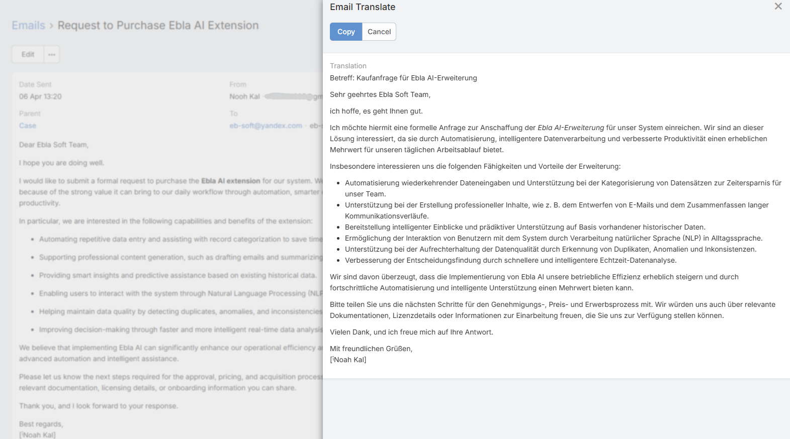

# Email Translation

Email Translation translates an email into the current user's language using AI.

## Requirements

Users need:

- `Ai` access
- Read access to Email
- A configured default AI provider

Administrators also need:

- **Enable Email Translate** turned on in **AI Settings -> Translate**
- A configured **AI Email Translate Default Prompt** (recommended for consistent output)

## Translating an Email

1. Open an Email.
2. Click **Translate**.
3. Wait for the translation to complete.
4. Review the translated text in the modal.
5. Click **Copy** if needed.

## Target Language Resolution

The target language is resolved automatically from:

1. The user's language preference
2. The system default language if the user has no language preference

## Important Clarification

`AI Translate Languages` in AI Settings does not control the target language for email translation.

That setting is used for field and stream translation menus.

Email translation instead uses the user's resolved CRM language.

## Prompt Placeholders

The email translation prompt can use:

- `{{language}}`
- `{{subject}}`
- `{{bodyPlain}}`
- `{{body}}`

This makes it possible to create translation prompts that preserve tone or format.

## Optional Translation Profile

You can assign **AI Email Translate Default Profile** if you want translations to use a dedicated provider or model.

If no translation profile is assigned, the feature falls back to the normal default profile behavior.

## Related Features

- [AI Prompts](ai-prompts.md)
- [AI Profiles](ai-profiles.md)
- [AI Email Composer](email-composer.md)
