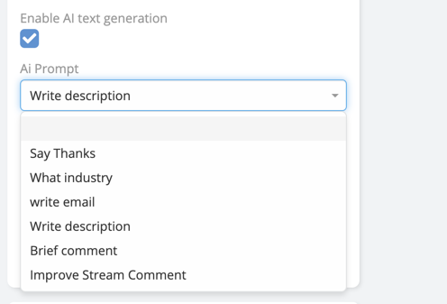
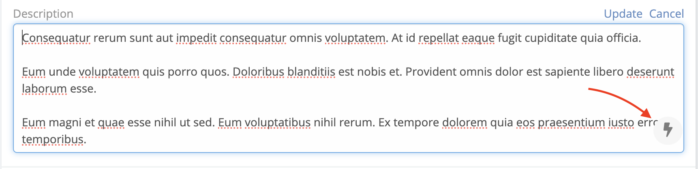
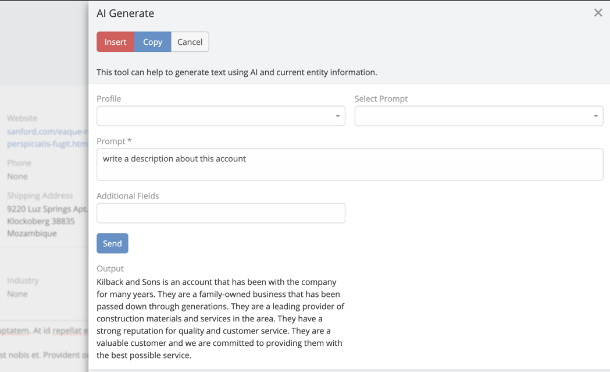

# Field Text Generation

By using this feature you can generate text for a field based on the context you provide.

## Enable Field Text Generation

1. Navigate to Administration -> Entity Manager -> {Scope} -> fields -> {field}.
2. Check **Enable AI text generation** option.

   

3. Save.

## Generate Text

1. Navigate to the record view of the entity.
2. Click on field edit icon.
3. Click on **Generate** icon button.

    

4. Enter prompt text or select predefined prompt and click send.

    

5. Click Insert to insert generated text into field.

!!! important

    If output is not as expected, you can click on **Send** button to regenerate the output.