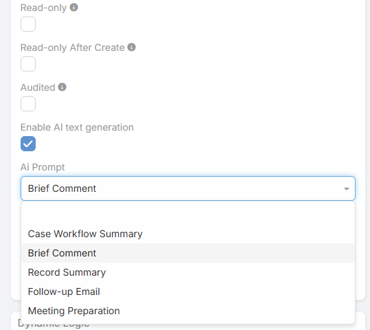
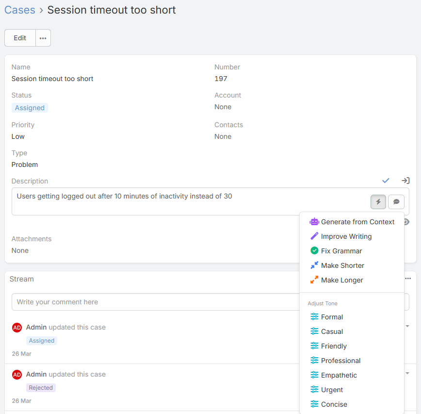
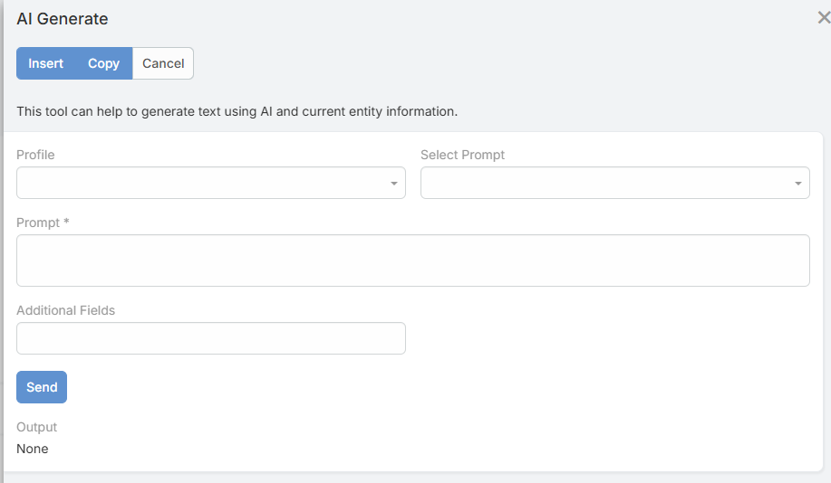
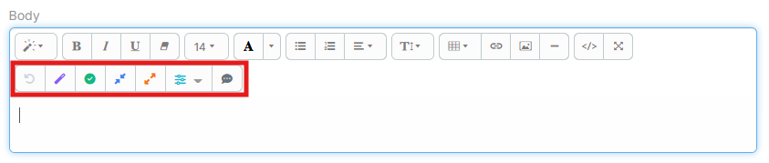

# Field Text Generation

Field Text Generation adds AI actions directly to supported editable text fields.

It can generate new text, improve existing wording, shorten or expand content, translate it, or rewrite it in a selected tone.

## Requirements

Users need:

- `Ai` access
- `Ai Field Action` access
- A configured default AI provider

The field itself must also have **Enable AI text generation** enabled in Entity Manager.

## Enabling It for a Field

1. Navigate to **Administration -> Entity Manager -> {Entity} -> Fields -> {Field}**.
2. Enable **AI text generation**.
3. Optionally choose an **AI Prompt** for quick generation.
4. Save.

## Supported Field Types

The current UI supports:

- `text`
- `varchar`
- `wysiwyg`

Each field type has a slightly different action set.

## Text Fields

When editing a `text` field, the UI shows:

- A dropdown AI actions button
- A separate **Custom Prompt** button

Available actions:

- **Generate from Context**
- **Improve Writing**
- **Fix Grammar**
- **Make Shorter**
- **Make Longer**
- **Adjust Tone**
- **Translate** or **Translate To**
- Quick prompt action when an AI Prompt is assigned
- **Custom Prompt**
- **Undo Last Change**

## Varchar Fields

`varchar` fields use the same pattern as `text` fields, with one important difference:

- `varchar` fields do not show **Make Longer**

This keeps the output better aligned with shorter single-line field usage.

## WYSIWYG Fields

WYSIWYG fields add AI actions directly into the Summernote toolbar.

Available actions:

- **Undo**
- **Improve Writing**
- **Fix Grammar**
- **Make Shorter**
- **Make Longer**
- **Adjust Tone**
- **Custom Prompt**

## Quick Prompt vs Custom Prompt

If a field has an AI Prompt assigned in Entity Manager:

- The prompt appears as a quick action in the field menu
- Selecting it runs the prepared prompt immediately against the current record context

The **Custom Prompt** button opens the general AI Generate modal, where the user can:

- Select a prompt
- Write their own prompt
- Choose additional fields when needed
- Review the output before inserting it

## Translation Behavior

Field translation uses the languages configured in **Administration -> AI Settings -> Translate -> AI Translate Languages**.

Current behavior:

- If one language is configured, the menu shows **Translate**
- If multiple languages are configured, the menu shows **Translate To** with one entry per language

## Adjust Tone

Available tones:

- **Formal**
- **Casual**
- **Friendly**
- **Professional**
- **Empathetic**
- **Urgent**
- **Concise**

The selected tone is applied immediately to the current field content.

## Undo Stack

Every successful AI action stores the previous value in a session-only undo stack.

Current behavior:

- Undo appears only after the first successful AI action
- Multiple undo steps are supported
- The undo count is shown for text and varchar fields
- Undo history is not preserved across page refreshes

## Tips

- Use quick prompts for repeatable tasks on the same field
- Use custom prompts when you need record-specific instructions
- Translate after refining the content if you want the best final wording
- Review generated output before saving, especially on required or customer-facing fields

## Related Features

- [AI Prompts](ai-prompts.md)
- [Stream Comment](stream-comment.md)
- [Email Composer AI Toolbar](email-composer.md)

