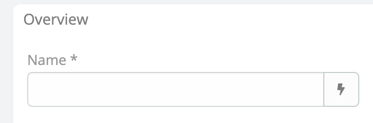

# Field Text Generation

By using this feature you can generate text for a field based on the context you provide.

## Enable Field Text Generation

1. Navigate to Administration -> Entity Manager -> {Scope} -> fields -> {field}.
2. Check **Enable AI text generation** option.
3. (Optional) Select predefined prompt to enable Quick Text Generation.

   

4. Save.

## Generate Text

1. Navigate to the record view of the entity.
2. Click on field edit icon.
3. Click on **Generate** icon button.

   
   
4. If you have predefined prompt selected, the text will be generated automatically, otherwise AI Generate Modal will be
   appearing.
5. Enter prompt text or select predefined prompt and click send.

   

6. Click Insert to insert generated text into field.

!!! important

    If output is not as expected, you can click on **Send** button to regenerate the output.

## Multi-Level Undo

Every AI action performed on a field (improve, grammar, shorter, longer, translate, generate) saves the previous field value before applying changes. This allows you to step back through multiple AI edits.

### Using Undo

- After the first AI action, an **Undo** button appears with a count label, for example: "Undo (2 steps)".
- Click the button to restore the previous value.
- Continue clicking to step back through all saved versions.
- The count in the label decreases with each undo until there are no more steps.

### Notes

- The undo stack supports unlimited steps — every AI action adds a new entry.
- The undo button is hidden until at least one AI action has been performed.
- The undo stack is only available during the current editing session and is not persisted across page refreshes.

## Translate Behavior

The Translate option adapts its appearance based on how many languages are configured in the AI settings:

- **0 languages configured** — the Translate option is hidden entirely from the AI actions menu.
- **1 language configured** — a single **Translate** button is shown directly in the menu. Clicking it translates the field content immediately without a submenu.
- **2 or more languages configured** — a **Translate** sub-menu appears. Hover or click it to expand the list of available languages and select the target language.