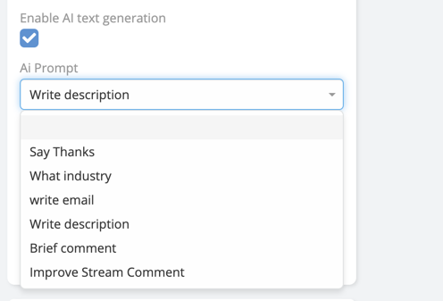
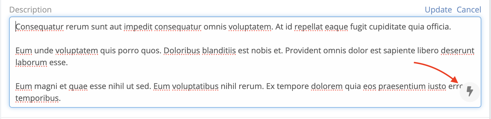
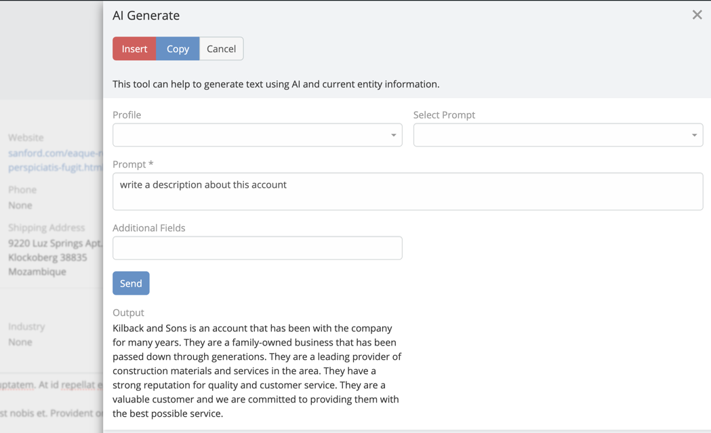

# Field Text Generation

Enable AI-powered actions on any text or varchar field. When enabled, a ⚡ bolt button appears on the field in edit mode — clicking it opens a dropdown menu with multiple AI actions.

## Enable Field Text Generation

1. Navigate to **Administration** → **Entity Manager** → select your entity type → **Fields** → select a field.
2. Check the **Enable AI Generate** option.
3. (Optional) Select a **Quick Prompt** to add a one-click shortcut to the dropdown.

   

4. Save.

## Using the AI Dropdown

1. Navigate to a record and click the field's edit icon.
2. A ⚡ bolt button appears:
   - On **text fields** (textarea): bottom-right corner of the field
   - On **varchar fields** (single-line input): appended to the right of the input
3. Click the ⚡ bolt button to open the dropdown menu.

   

While the AI is processing, the bolt icon changes to a ⏳ spinner. No other loading notification is shown.

## Dropdown Menu Actions

| Action | Description |
|--------|-------------|
| ↩ **Undo Last Change** | Reverts the field to its previous value. Only appears after an AI action has been performed. |
| ⚡ **Quick Prompt** | Runs the configured prompt template and fills the field instantly. Only shown if a Quick Prompt is set. |
| 🤖 **Generate from Context** | Generates content based on the other fields in the record. Works even when the field is empty. |
| ✨ **Improve Writing** | Makes the existing text more professional and clear. |
| ✓ **Fix Grammar** | Fixes grammar and spelling errors only — does not change meaning or style. |
| ↕ **Make Shorter** | Condenses the text while preserving key meaning. |
| ↕ **Make Longer** | Expands the text with more relevant detail. *(Text fields only)* |
| 🌐 **Translate To** | Translates the content to English, Arabic, French, Spanish, or German. |
| 💬 **Custom Prompt...** | Opens the full AI Generate modal for a custom prompt. |

!!! note

    **Generate from Context** is the only action that works on an empty field. All other actions require the field to have existing content.

!!! tip

    After any AI action, **Undo Last Change** appears at the top of the dropdown. Click it to instantly revert to the previous value if the result is not what you expected.

## Custom Prompt Modal

Selecting **Custom Prompt...** opens the AI Generate modal where you can:

- Write a custom prompt
- Select a predefined prompt from your library
- Choose a specific AI profile
- Preview the output before inserting

   

Click **Insert** to apply the result to the field, or **Copy** to copy it to the clipboard.
