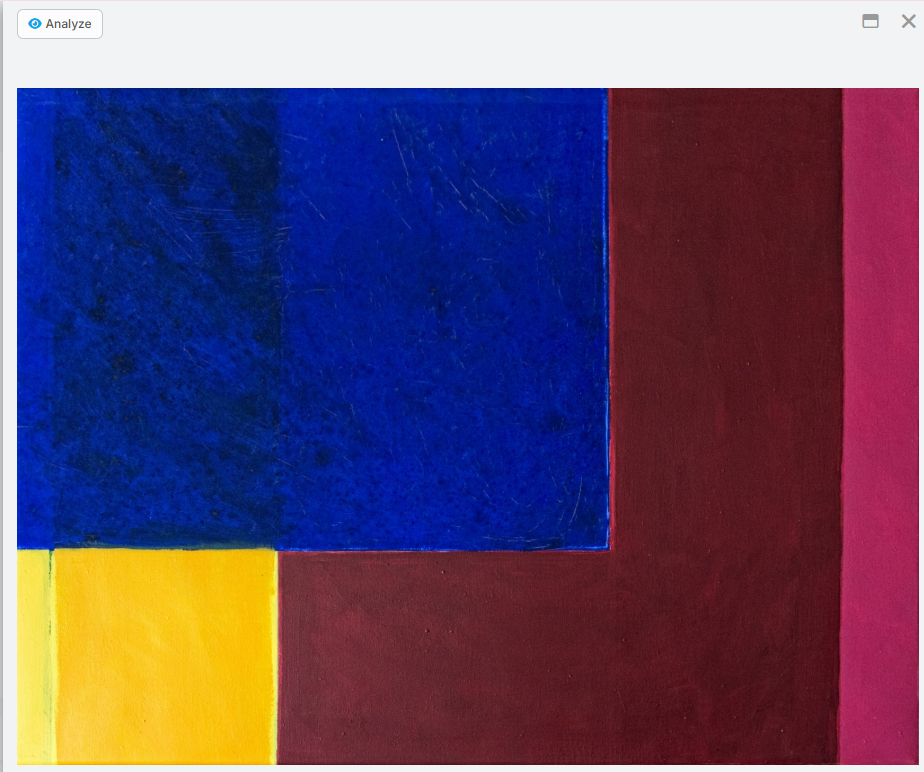
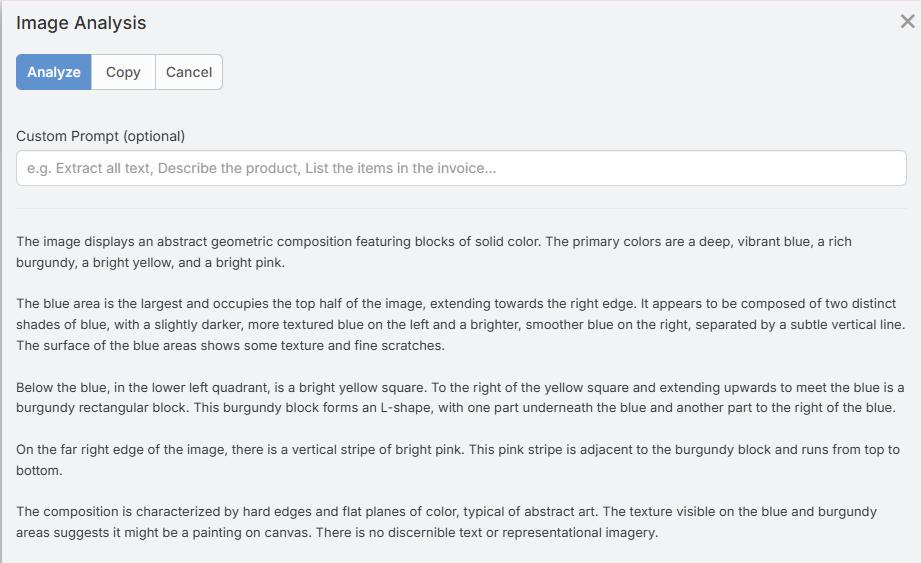

# Image Analysis

Image Analysis lets users ask AI questions about uploaded images directly inside EspoCRM.

It is intended for image-based attachments such as screenshots, scans, photos, and similar visual files.

## Requirements

Users need:

- `Ai` access
- `Ai Vision` access
- A configured default AI provider
- A vision-capable provider or profile

## Where It Appears

The current implementation exposes analysis in two places:

- On `Image` fields in detail view
- In the image preview modal



## Using Image Analysis

1. Open a record with an image field.
2. Click **Analyze**.
3. Enter an optional prompt.
4. Click **Analyze** in the modal.
5. Review the result.
6. Use **Copy** if you want to reuse the output elsewhere.



## Supported File Types

The backend accepts image attachments only.

Supported formats:

- `JPEG`
- `PNG`
- `GIF`
- `WebP`

Maximum file size:

- `10 MB`

## Prompt Usage

If you leave the prompt empty, the feature uses a default general image-analysis prompt.

Examples of useful prompts:

- "Extract the visible text from this image."
- "Summarize the key information in this screenshot."
- "Does this image contain a signature?"
- "List the line items visible in this receipt."

## Formula Support

Image analysis is also available in formula:

```text
eblaAi\analyzeImage(ATTACHMENT_ID, PROMPT, PROFILE_ID)
```

It returns the analysis text, or an error string starting with `Error:`.

See [Formula](formula.md) for examples.

## Limitations

- Only image files are supported
- PDF and document attachments are not analyzed by this feature
- Results depend on image quality and model capability
- A text-only provider or model will fail for vision requests

## Related Features

- [Image Generation](image-generation.md)
- [Formula](formula.md)
- [Access Control](access-control.md)
