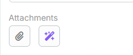
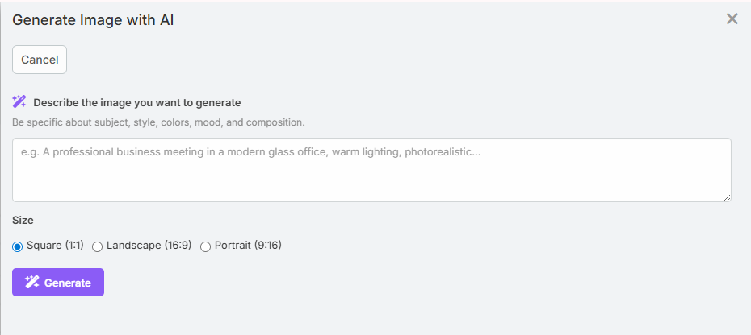

# AI Image Generation

AI Image Generation creates new images from a text prompt and saves them as EspoCRM attachments.

The generated image can then be attached to an `Image` field or appended to an `Attachment Multiple` field.

## Requirements

Users need:

- `Ai` access
- `Ai Vision` access
- A configured default AI provider
- A provider or profile that supports image generation

Recommended admin setting:

- **AI Settings -> AI Features -> Image Generation**
  for a dedicated image-capable profile.

## Enabling It on a Field

Image generation is opt-in per field.

1. Navigate to **Administration -> Entity Manager -> {Entity} -> Fields -> {Field}**.
2. Enable **AI Image Generation**.
3. Save.

This works for:

- `Image`
- `Attachment Multiple`

## Where the Button Appears

In the current UI:

- `Image` fields show the button in edit mode
- `Attachment Multiple` fields show an icon button in edit mode



## Using Image Generation

1. Open the record in edit mode.
2. Click the image-generation button.
3. Enter a prompt describing the image you want.
4. Select a size.
5. Click **Generate**.
6. Review the preview.
7. Click **Use Image**.



## Available Sizes

The current modal offers:

- `Square`
- `Landscape`
- `Portrait`

Provider-specific output dimensions depend on the selected provider and model.

## Field Behavior

### Image Field

For a single image field, the generated attachment replaces the current image reference.

### Attachment-Multiple Field

For an attachment-multiple field, the generated image is appended to the existing attachment list.

## Formula Support

Image generation is also available in formula:

```text
eblaAi\generateImage(PROMPT, SIZE, PROFILE_ID)
```

The function returns the generated attachment ID.

See [Formula](formula.md).

## Notes

- Anthropic and Ollama do not provide image generation in the current extension flows
- A provider that supports vision is not always the same as one that supports image generation, so choose the profile carefully
- Prompt quality has a large effect on output quality

## Related Features

- [Image Analysis](image-analysis.md)
- [Formula](formula.md)
- [AI Profiles](ai-profiles.md)
