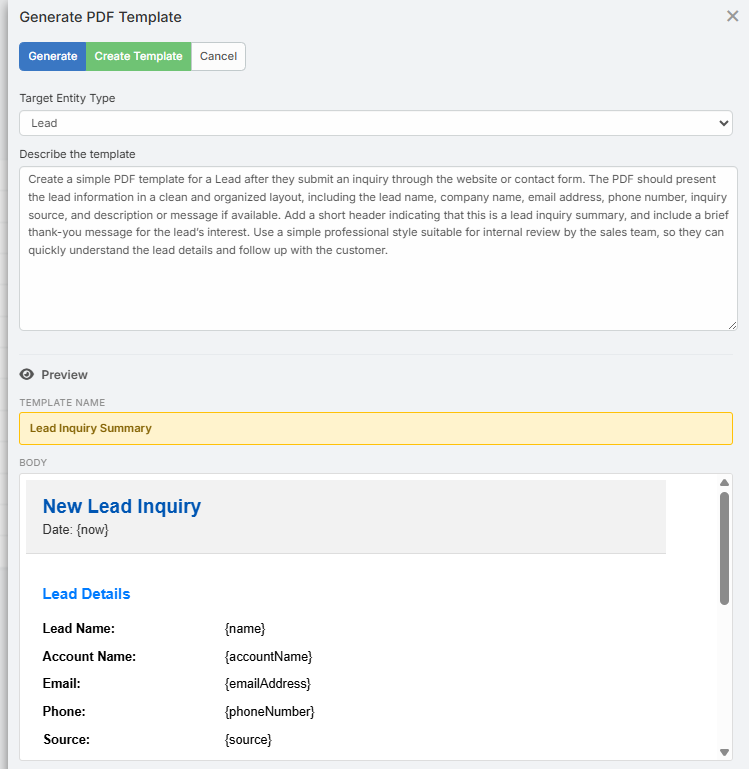

# AI PDF Template Generation

The AI PDF Template Generator creates EspoCRM PDF templates from a plain-language description. It generates a template name and a full HTML body designed for PDF rendering, including entity placeholders where appropriate.

## Where to Find It

The feature is available from the **PDF Template** list view.

1. Navigate to **Administration** → **PDF Templates**.
2. Click **Generate PDF Template** in the list view header.

## How It Works

1. Click **Generate PDF Template**.
2. A modal opens with:
   - **Entity Type** - optional; used to expose the correct placeholders
   - **Description** - describe the template you want to generate
3. Click **Generate**.
4. The AI returns:
   - A template **Name**
   - A complete HTML **Body**
5. Review the live preview in the modal.
6. Click **Create Template**.
7. The standard EspoCRM PDF Template create form opens with the AI-generated content prefilled.
8. Review the result and save.

## Placeholder Support

When you choose an **Entity Type**, the generator uses the available fields of that entity to build the placeholder list.

Examples:

- `{name}`
- `{assignedUserName}`
- `{accountName}`
- `{today}`
- `{currentYear}`

The AI is instructed to use only supported placeholders and keep them in EspoCRM's normal `{placeholder}` format.

## Output Format

The generated PDF template body is:

- HTML-based
- Intended for PDF rendering
- Structured for print-friendly layouts
- Generated without wrapping `<html>`, `<head>`, or `<body>` tags

Typical output includes:

- A document header
- A main content section
- Tables or structured blocks where useful
- A footer area

## Tips for Better Results

- Mention the document purpose clearly, such as invoice, quote, proposal, statement, or certificate.
- Mention sections you want included, for example totals, customer details, payment instructions, or approval blocks.
- Select the correct entity type so the AI can use the proper placeholders.

!!! tip

    A more specific description usually gives a much better result than a short generic phrase.

## Notes

- The AI does not save anything automatically.
- The generated template is reviewed in the normal create form before you save.
- If the entity type is selected, the create form is opened with that entity context and the AI-generated body applied automatically.

## Related Features

- [AI Email Template Generation](email-template.md) - Generate email templates with placeholders
- [AI Profiles](ai-profiles.md) - Configure provider, model, and behavior
- [AI Log](ai-log.md) - Inspect the generated request and response
