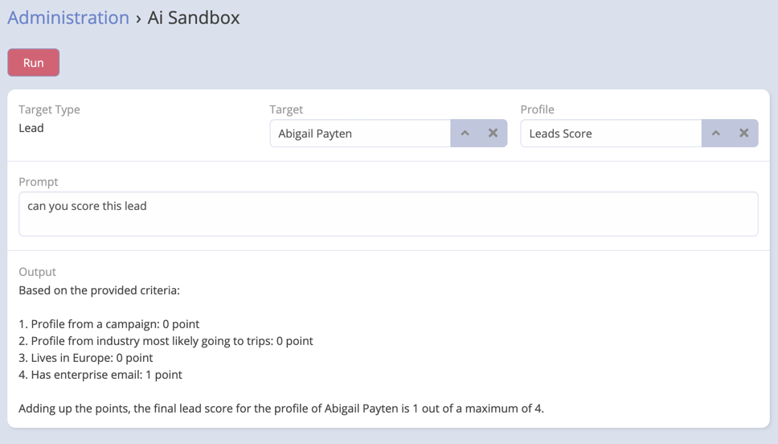

# AI Sandbox

The AI Sandbox is a feature of Ebla AI that allows users to test and experiment with AI prompts and prompts. The AI
Sandbox is a safe environment where you can test your AI prompts and formula functions without affecting your CRM data.

## Using AI Sandbox

1. Navigate to **Administration** -> **AI Sandbox**.
2. Select **Entity Type** / **Entity** / **Profile**.
3. Enter the prompt context.
4. Click **Send**.

___

