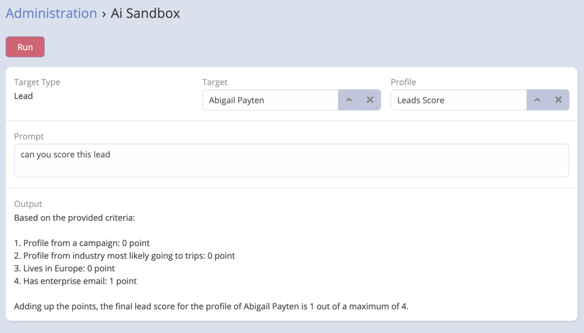

# AI Sandbox

The AI Sandbox is an administrator-facing testing page for prompts and record-aware AI instructions. It lets you experiment with prompts, profiles, and optional tool-enabled execution without changing production data or normal user workflows.

## Where to Find It

1. Navigate to **Administration**.
2. Open **AI Sandbox** from the Ebla AI administration section.

## What the Sandbox Is For

Use the sandbox when you want to:

- Test a prompt against a real record
- Try a specific AI Profile
- Compare plain prompt execution with tool-enabled execution
- Inspect which tools were used during a tool-enabled request

## Sandbox Fields

The page includes:

- **Entity Type**
- **Target Record**
- **Profile**
- **Enable Tools**
- **Prompt**
- **Output**
- **Error**
- **Tools Used**

## Using the Sandbox

1. Select an **Entity Type**.
2. Optionally choose a **Target Record**.
3. Optionally choose an **AI Profile**.
4. Enter your prompt.
5. Decide whether to enable **Tools**.
6. Run the request.

!!! note

    The available **Target Record** options depend on the selected **Entity Type**.

## Run Modes

### Standard Mode

With **Enable Tools** turned off, the sandbox sends the prompt through the generic AI execution flow.

This is useful for:

- Prompt drafting
- Testing profile behavior
- Evaluating output tone and structure

### Tool-Enabled Mode

With **Enable Tools** turned on, the sandbox uses the AI Chat tool-calling flow instead of plain prompt execution.

This is useful for:

- Testing CRM-aware requests
- Validating tool-calling behavior
- Seeing which tools were used and how many iterations were required

## Output Areas

### Output

Displays the AI's final text result.

### Error

Shows validation or request errors when the request fails.

### Tools Used

In tool-enabled mode, this section shows:

- The tools called
- Their arguments
- Shortened result previews
- Iteration count
- Input and output token totals

## Notes

- The sandbox remembers the last selected target type, target record, profile, and prompt for convenience during the same browser session
- It is intended for testing and experimentation
- It does not directly replace admin confirmation and review for actual CRM changes

## Related Features

- [AI Admin Assistant](admin-assistant.md)
- [AI Profiles](ai-profiles.md)
- [AI Prompts](ai-prompts.md)
- [AI Chat Panel](ai-chat.md)
