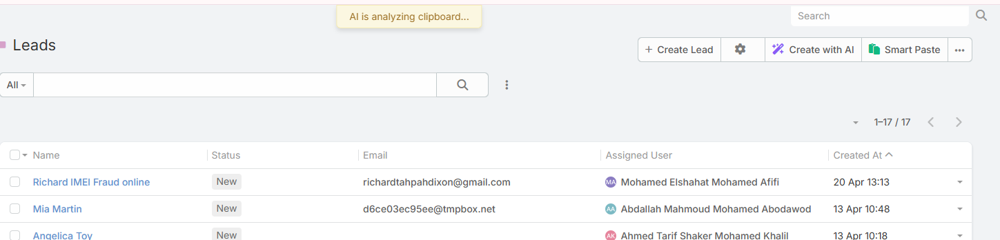

# Smart Paste

Smart Paste reads copied text from the clipboard, extracts structured values with AI, and fills the matching EspoCRM fields for the target entity.

It is useful for turning business cards, email signatures, copied messages, meeting notes, or other semi-structured text into CRM data quickly.

## Requirements

Users need:

- `Ai` access
- `Ai Smart Paste` access
- A configured default AI provider
- Create access for new-record Smart Paste

Administrators also need to configure visibility in **Administration -> AI Settings -> General -> Smart Paste Scopes**.

## Where Smart Paste Appears

The current build can show Smart Paste in three places:

- Main list view headers
- Relationship panel lists
- New-record forms




## Current Workflow

Smart Paste does not open a text-entry modal in the current implementation.

Instead, the feature works like this:

1. Copy text to your clipboard.
2. Click **Smart Paste**.
3. Confirm that the feature should read the clipboard.
4. Ebla AI reads the clipboard text and analyzes it against the target entity fields.
5. The result is applied directly to the form, or used to open a pre-filled create form.

## Behavior by Location

### Main List Views

From a main list page, Smart Paste:

1. Reads clipboard text
2. Extracts values for the current entity type
3. Opens the standard create form with the extracted values pre-filled

### Relationship Panels

From a relationship panel list, Smart Paste follows the same flow:

1. Reads clipboard text
2. Extracts values for the panel entity type
3. Opens a create form with pre-filled values

### New-Record Forms

When used inside a new-record form, Smart Paste applies the extracted values directly into the current unsaved record instead of opening another form.

There is also a keyboard shortcut:

- `Ctrl+Alt+V`

## What Smart Paste Can Fill

Smart Paste works best with standard storable fields such as:

- Text and varchar fields
- Email and phone fields
- Numeric fields
- Date and datetime fields
- Enum and boolean fields
- Address-style fields

The field labels and tooltips are used as part of the AI context, so clear field naming improves extraction quality.

## What Smart Paste Does Not Fill Well

The current implementation is not intended for:

- File uploads
- Complex relationship linking
- Advanced multi-record logic
- Guaranteed exact matching for ambiguous input

You should still review the result before saving.

## Example

Copied text:

```text
John Smith
Senior Sales Manager
Acme Corporation
john.smith@acme.com
+1 (555) 123-4567
123 Business Ave, Suite 100
New York, NY 10001
```

Typical result:

- First name
- Last name
- Job title
- Company
- Email
- Phone
- Address details

## Tips

- Copy the cleanest version of the source text you can
- Semi-structured input usually performs better than noisy paragraphs
- Add helpful field tooltips in Entity Manager for better matching
- Review enum, relationship, and date values carefully before saving

## Related Features

- [AI Create](ai-create.md)
- [Field Text Generation](field-text-generation.md)
- [AI Profiles](ai-profiles.md)
