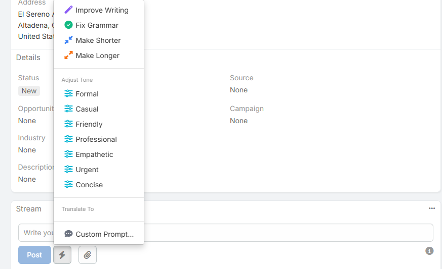

# Stream Comment

The Stream Comment feature adds AI writing actions to the record stream post box.

It helps users refine, translate, or rewrite comments before posting them to the stream.

## Requirements

Users need:

- `Ai` access
- `AiFieldAction` access
- A configured default AI provider

## Using AI in the Stream

1. Open a record detail view.
2. Go to the **Stream** panel.
3. Type a draft comment in the post box.
4. Click the AI button beside the post controls.
5. Choose the action you want.
6. Review the updated text in the comment box.
7. Click **Post** when ready.

## Available Actions

- **Improve Writing**
- **Fix Grammar**
- **Make Shorter**
- **Make Longer**
- **Adjust Tone**
- **Translate** or **Translate To**
- **Custom Prompt...**
- **Undo Last Change**

## Adjust Tone

The tone menu offers:

- **Formal**
- **Casual**
- **Friendly**
- **Professional**
- **Empathetic**
- **Urgent**
- **Concise**

## Translation Behavior

Stream translation uses the same language list configured in **AI Settings -> Translate -> AI Translate Languages**.

Current behavior:

- One configured language shows a single **Translate** action
- Multiple configured languages show **Translate To**

## Undo Behavior

After the first successful AI action, **Undo Last Change** appears at the top of the menu.

Undo is:

- Session-only
- Multi-step
- Limited to the current unsent comment draft

## Custom Prompt

The **Custom Prompt...** action opens the general AI Generate modal with the current comment text passed in as context.

This is useful when the built-in improve/grammar/shorter/longer actions are not specific enough.

## Notes

- Stream AI works on the draft text currently in the comment box
- The generated text is not posted automatically
- You can keep refining the draft before posting

## Related Features

- [Field Text Generation](field-text-generation.md)
- [AI Prompts](ai-prompts.md)
