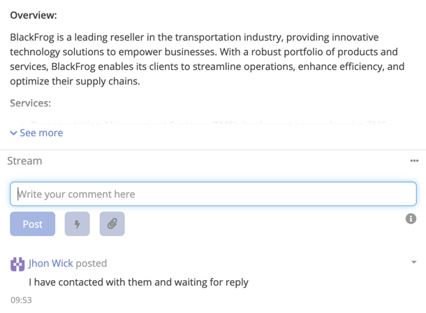

# Stream Comment Reply

By using this feature you can generate and refine a stream comment using AI. The AI uses the record context and existing
stream activity to produce relevant, well-written replies.

## Using AI on a Stream Comment

1. Navigate to the record you want to comment on.
2. Click on the **Stream** section and focus the **Write your comment here** textarea.
3. Type your draft text (optional — can also start empty for generation).
4. Click the **bolt icon** button next to the comment area. The AI button sits inline alongside the **Post** and attachment buttons, styled consistently with the attachment button.

   

5. Choose an action from the dropdown:

| Action | Description |
|--------|-------------|
| **Undo Last Change** | Restores the previous comment text. Hidden until at least one AI action has been performed. |
| **Improve Writing** | Rewrites the comment for clarity and professionalism. |
| **Fix Grammar** | Corrects grammar and spelling without changing the meaning. |
| **Make Shorter** | Condenses the comment to its essential points. |
| **Make Longer** | Expands the comment with more detail and context. |
| **Adjust Tone** | Rewrites the comment in a selected tone. Expands into a sub-menu with 7 options: Formal, Casual, Friendly, Professional, Empathetic, Urgent, Concise. |
| **Translate** | Translates the comment. Shows a single button if one language is configured, or a sub-menu if multiple languages are configured. Hidden if no translation languages are set. |
| **Custom Prompt...** | Opens the AI Generate modal where you can enter a custom instruction or select a predefined prompt. |

6. The comment textarea is updated with the AI result automatically.
7. Click **Post** to submit the final comment.

!!! important

    If the output is not as expected, you can run the action again or use **Custom Prompt...** for more specific instructions.

## Dropdown Rendering

The AI actions dropdown is rendered via a **portal pattern** — it is appended to `<body>` and positioned with `position: fixed`. This ensures the menu is never clipped by parent containers with `overflow: hidden` or low z-index stacking contexts.

Additional scroll behavior:
- While the menu is open, it repositions itself on scroll to stay aligned with the trigger button.
- If the trigger button scrolls out of the viewport, the menu closes automatically.

## Adjust Tone

Selecting **Adjust Tone** opens a sub-menu with the following tones:

| Tone | Description |
|------|-------------|
| **Formal** | Structured, professional language |
| **Casual** | Relaxed, conversational language |
| **Friendly** | Warm, approachable language |
| **Professional** | Clear, business-appropriate language |
| **Empathetic** | Compassionate language that acknowledges feelings |
| **Urgent** | Direct, action-oriented language |
| **Concise** | Stripped-down language that says more with less |

## Undo

After any AI action, the **Undo Last Change** option becomes visible at the top of the dropdown. Clicking it restores
the comment text to what it was before the last AI action. The undo is session-only and is not persisted.
