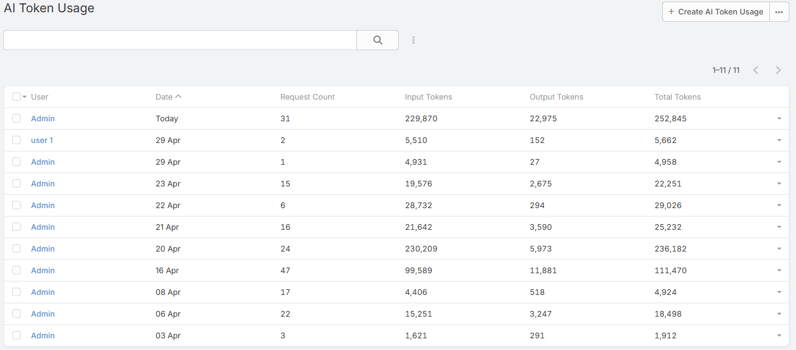
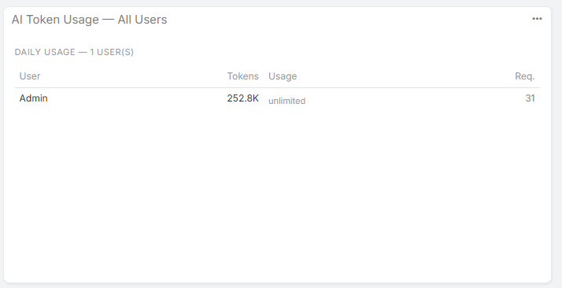

# Token Usage Statistics

Ebla AI records token usage for AI requests and exposes both aggregate and per-request visibility.

## Overview

The extension tracks:

- Input tokens
- Output tokens
- Total tokens
- Request count

Daily aggregate usage is stored in `AiTokenUsage`.

Per-request details are stored in `AiLog`.

## Viewing Usage

1. Navigate to **{{siteUrl}}/#AiTokenUsage**.
2. Review usage by user and date.
3. Open **AI Log** when you need call-level detail.

## Token Limits

System-wide limits are configured in:

- **Administration -> AI Settings -> Token Limits**

Available settings:

- **Default Token Limit**
- **Token Limit Period**
- **Max Tool-Call Iterations**

## Per-User Override

Each user record includes **AI Monthly Token Limit**.

Important clarification:

- The field label says **Monthly**
- The value actually acts as the user's override for the currently configured limit period

That period may be:

- Daily
- Weekly
- Monthly

Set the field to `0` to fall back to the global default.

## Cache Hits and Token Usage

When a request is served from the response cache:

- The response is returned faster
- No new provider call is made
- No new tokens are consumed for that cached request
- The call is still visible in **AI Log** as a cache hit

This is especially important for repeat analysis and generation requests.

## Dashlets

The extension includes token-usage dashlets for dashboards.

Available dashlets:

- **My AI Token Usage**
- **AI Token Usage - All Users**

## AI Log Relationship

Use **AI Log** together with **AI Token Usage** when you need to answer questions such as:

- Which feature consumed the most tokens?
- Was this response cached?
- Which user triggered the request?
- Which profile and provider were used?

## Notes

- Administrators are not blocked by token limits
- Limit enforcement happens before new provider calls are made
- Feature usage, cache behavior, and token totals are easier to audit when both **AI Log** and **AI Token Usage** are enabled in your admin workflow

## Related Features

- [Access Control](access-control.md)
- [Admin Settings](admin-settings.md)
