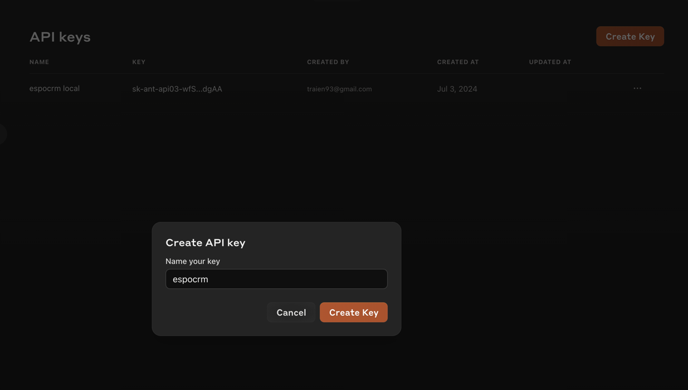
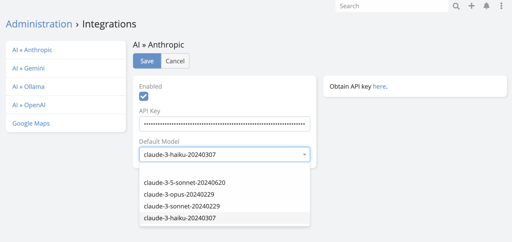

# Anthropic Integration Setup

## API Setup

1. Go to [Anthropic](https://console.anthropic.com/settings/keys) and sign in to your account.
2. Click "Create Key" to generate a new API key.
3. Give it a name then click "Create Key".
   
4. Copy the API key.

## EspoCRM Setup

1. Navigate to **Administration** -> **Integrations** -> **Anthropic**.
2. Paste the API key obtained from OpenAI into API Key field.
3. Choose the default model you want to use.

   
