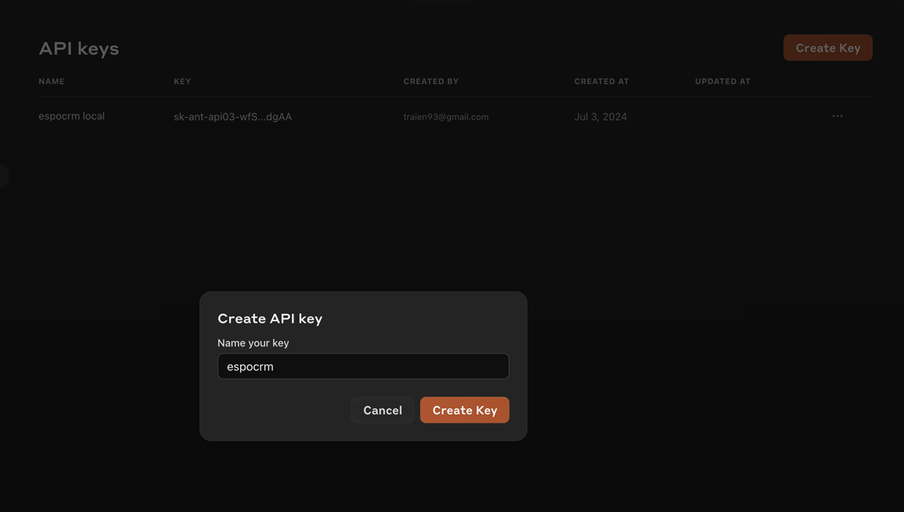
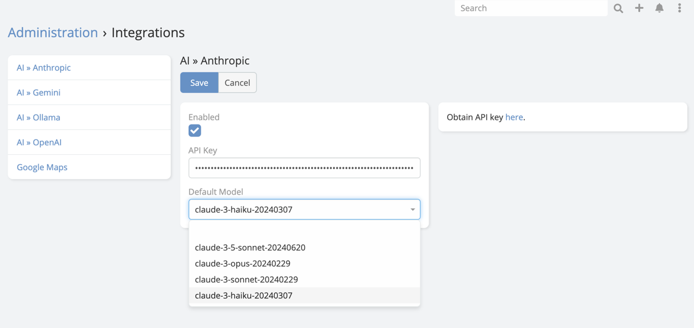

# Anthropic Integration Setup

## API Setup

1. Go to [Anthropic](https://console.anthropic.com/settings/keys) and sign in to your account.
2. Click "Create Key" to generate a new API key.
3. Give it a name then click "Create Key".
   
4. Copy the API key.

## EspoCRM Setup

1. Navigate to **Administration** -> **Integrations** -> **Anthropic**.
2. Paste the API key obtained from Anthropic into API Key field.
3. Choose the default model you want to use.

   

## Final Step in AI Settings

After saving the integration:

1. Navigate to **Administration** -> **AI Settings**.
2. Open the **General** tab.
3. Set **Default AI Provider** to **Anthropic**.
4. Save.

## Capability Notes

Anthropic is suitable for:

- Chat and text generation
- Vision analysis on supported models

It is not used by the current extension flows for image generation or speech generation.
