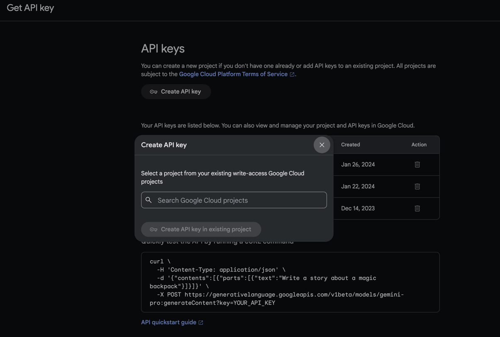
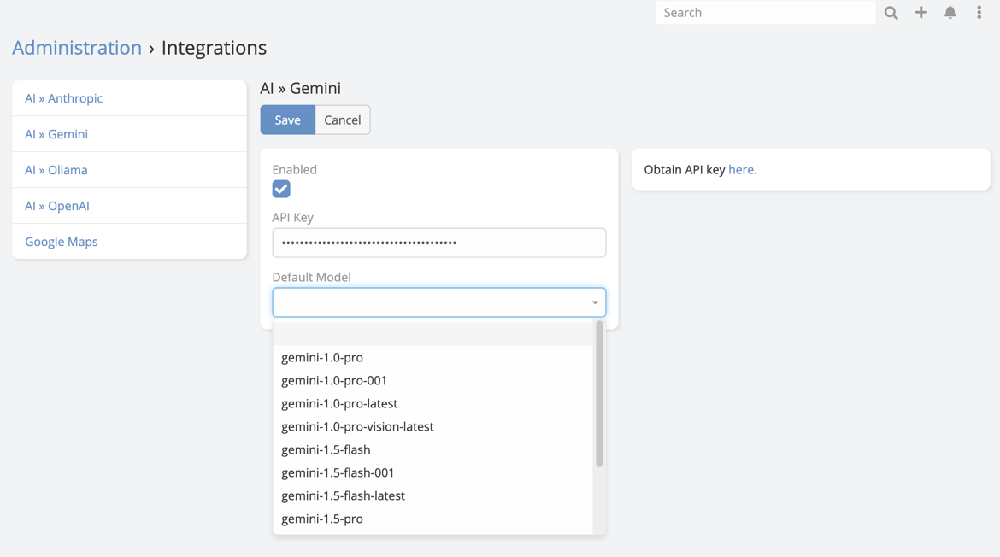

# Google Gemini Integration Setup

## API Setup

1. Go to [Gemini](https://aistudio.google.com/app/apikey) and sign in to your account.
2. Press "Create API key" to generate a new API key.
3. Select or create a project and press "Create API key in existing project".
   
4. Copy the API key.

## EspoCRM Setup

1. Navigate to **Administration** -> **Integrations** -> **Gemini**.
2. Paste the API key obtained from Gemini into API Key field.
3. Choose the default model you want to use.

   

## Final Step in AI Settings

After saving the integration:

1. Navigate to **Administration** -> **AI Settings**.
2. Open the **General** tab.
3. Set **Default AI Provider** to **Gemini**.
4. Save.

## Capability Notes

Gemini is commonly used in the extension for:

- Chat and text generation
- Vision analysis
- Image generation
- Speech generation
