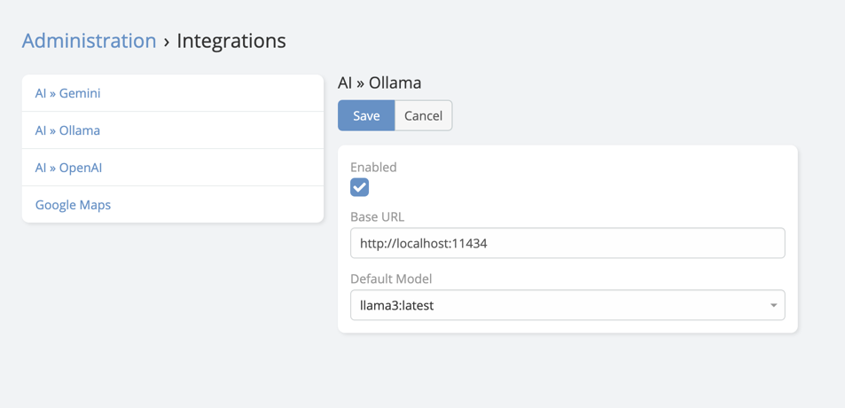

# Ollama Integration Setup

## API Setup

1. Go to [Ollama](https://ollama.com/) and download it.
2. Run Ollama app.
3. Open Terminal/CMD app and pull one of the [models](https://ollama.com/library) using this command for example:

   ```bash
    ollama run llama3
   ```
4. Default Ollama API url is: `http://localhost:11434`

## EspoCRM Setup

1. Navigate to **Administration** -> **Integrations** -> **Ollama**.
2. Paste the API Base URL.
3. Choose the default model you want to use.

   
   
