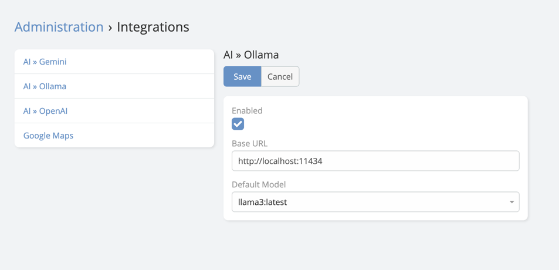

# Ollama Integration Setup

## API Setup

1. Go to [Ollama](https://ollama.com/) and download it.
2. Run Ollama app.
3. Open Terminal/CMD app and pull one of the [models](https://ollama.com/library) using this command for example:

   ```bash
    ollama run llama3
   ```
4. Default Ollama API url is: `http://localhost:11434`

## EspoCRM Setup

1. Navigate to **Administration** -> **Integrations** -> **Ollama**.
2. Paste the API Base URL.
3. Choose the default model you want to use.

   

## Final Step in AI Settings

After saving the integration:

1. Navigate to **Administration** -> **AI Settings**.
2. Open the **General** tab.
3. Set **Default AI Provider** to **Ollama**.
4. Save.

## Capability Notes

Ollama is mainly useful for local text-generation and chat scenarios.

Feature support depends on the model you run locally.

In the current extension documentation set, Ollama should not be assumed to support:

- Image generation
- Speech generation

Test the selected local model before enabling more advanced AI workflows.
