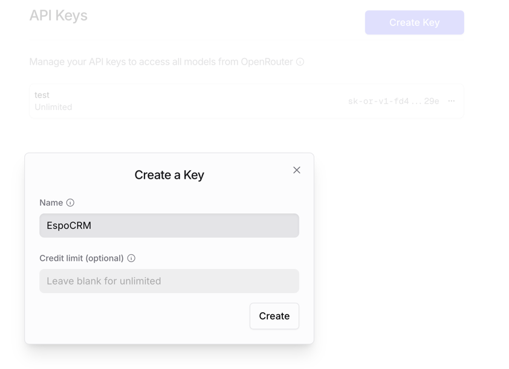
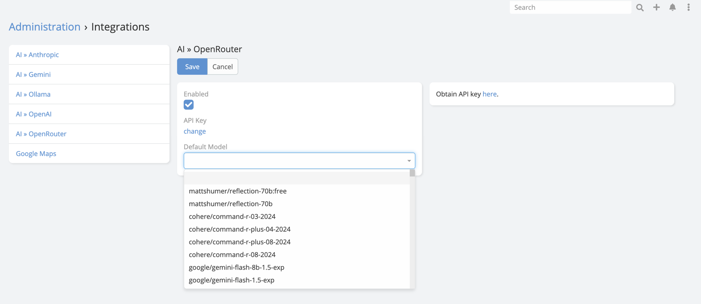

# OpenRouter Integration Setup

## API Setup

1. Go to [OpenRouter](https://openrouter.ai/keys) and sign in to your account.
2. Click "Create Key" to generate a new API key.
3. Give it a name then click "Create Key".
   
4. Copy the API key.

## EspoCRM Setup

1. Navigate to **Administration** -> **Integrations** -> **OpenRouter**.
2. Paste the API key obtained from OpenRouter into API Key field.
3. Choose the default model you want to use.

   

## Final Step in AI Settings

After saving the integration:

1. Navigate to **Administration** -> **AI Settings**.
2. Open the **General** tab.
3. Set **Default AI Provider** to **OpenRouter**.
4. Save.

## Capability Notes

OpenRouter capability depends on the routed model you choose.

Recommended approach:

- Use it for chat and text generation first
- Verify vision support before enabling image-analysis workflows
- Test advanced generation features with the selected model before documenting them for end users
