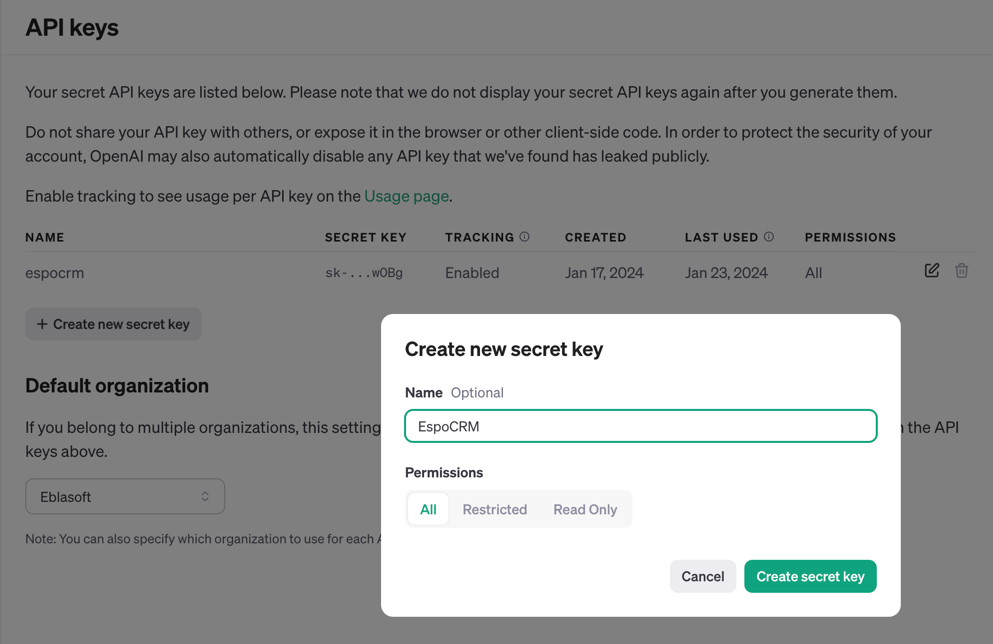
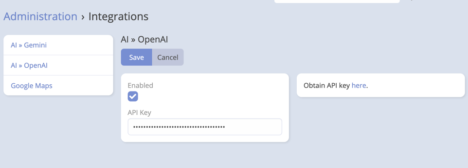

# OpenAI Integration Setup

## API Setup

1. Go to [OpenAI](https://platform.openai.com/api-keys) and sign in to your account.
2. Press "Create new secret key" to generate a new API key.
3. Give it a name and All permissions then press "Create secret key".
   
4. Copy the API key.

## EspoCRM Setup

1. Navigate to **Administration** -> **Integrations** -> **OpenAI**.
2. Paste the API key obtained from OpenAI into API Key field.
3. Choose the default model you want to use.

   

## Final Step in AI Settings

After saving the integration:

1. Navigate to **Administration** -> **AI Settings**.
2. Open the **General** tab.
3. Set **Default AI Provider** to **OpenAI**.
4. Save.

!!! important

    Configuring the integration alone is not enough. The extension also needs a default provider selected in **AI Settings** before most AI features become available.

## Capability Notes

OpenAI is suitable for:

- Chat and text generation
- Vision analysis
- Image generation
- Speech generation
