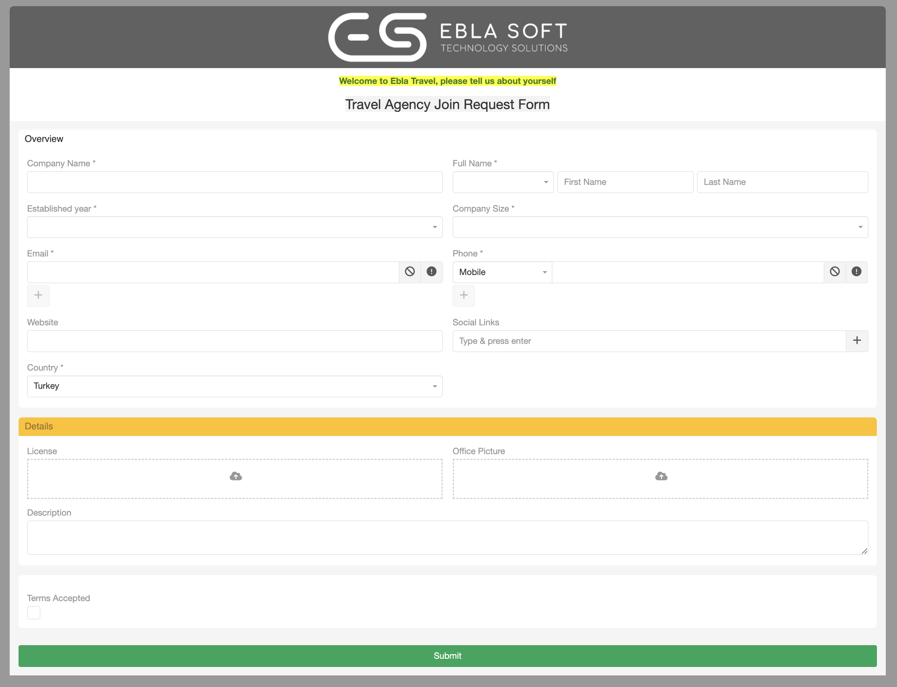

# Public Forms 

> Public forms for EspoCRM can be embedded in IFrames to your website or sent as links via emails.
> is available in [Ebla Public Forms](https://www.eblasoft.com.tr/espocrm-extension-page/feedback-forms).

---

<iframe width="560" height="315" src="https://www.youtube.com/embed/MQI1cw6V3dg?si=ay7ofu0x4Gl3E5KI" title="YouTube video player" frameborder="0" allow="accelerometer; autoplay; clipboard-write; encrypted-media; gyroscope; picture-in-picture; web-share" allowfullscreen></iframe>

---

---

**-** Go to **Administration** -> **Ebla Public Form Defs** -> **Create Ebla Public Form**.

 

###  [ChangeLog](changelog.md) 
