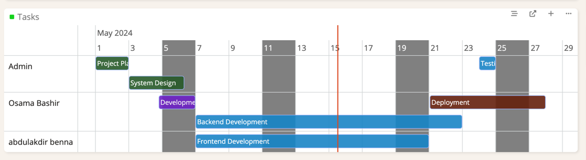

# Gantt View  

# Ebla Gantt

## Overview

Ebla Gantt is a powerful EspoCRM extension that transforms your Event entity records into a visually engaging and
interactive Gantt chart. It allows you to effortlessly manage and visualize your project timelines, fostering improved
collaboration and productivity.

## Key Features

- **Gantt View:** Easily switch to a Gantt view for your Event records, providing a comprehensive timeline perspective.
- **Drag-and-Drop Scheduling:** Adjust event durations and deadlines with the intuitive drag-and-drop functionality on
  the Gantt chart.
- **Color-Coded Events:** Visually distinguish events by status, getting color-style from field params for
  each status.
- **Weekend Highlighting:**  Weekend days are clearly identified in grey, enhancing the visual clarity of your
  timelines.
- **Zoom Control:** Use Ctrl + Mouse Wheel to easily zoom in and out of the Gantt chart, allowing you to focus on
  specific periods or get an overview of the entire timeline.
- **New Tab Access:** Open the Gantt chart in a new tab for seamless multitasking and extended workspace.
- **Event Details:** Double-click on any event in the Gantt chart to open a modal window, displaying detailed
  information about that specific event.

## Benefits

- **Improved Visual Understanding:** Easily grasp project timelines, dependencies, and milestones with a visual
  representation.
- **Enhanced Collaboration:** Facilitate seamless communication and coordination among team members.
- **Increased Efficiency:** Streamline scheduling and task management with intuitive drag-and-drop functionality.
- **Data-Driven Decisions:** Make informed decisions based on a clear understanding of event timing and progress.

## Support

For any assistance, inquiries, or feature requests, please visit the official [portal](https://portal.eblasoft.com.tr).

## ChangeLog

