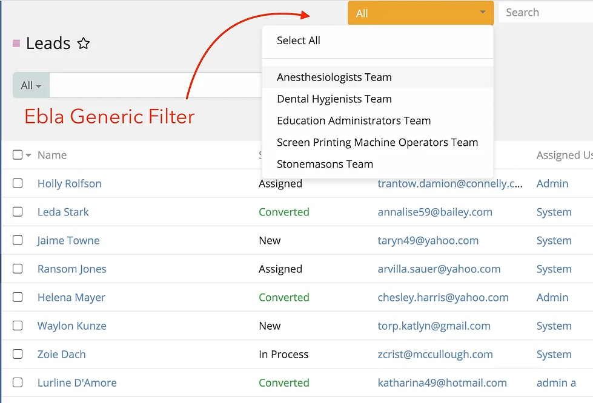
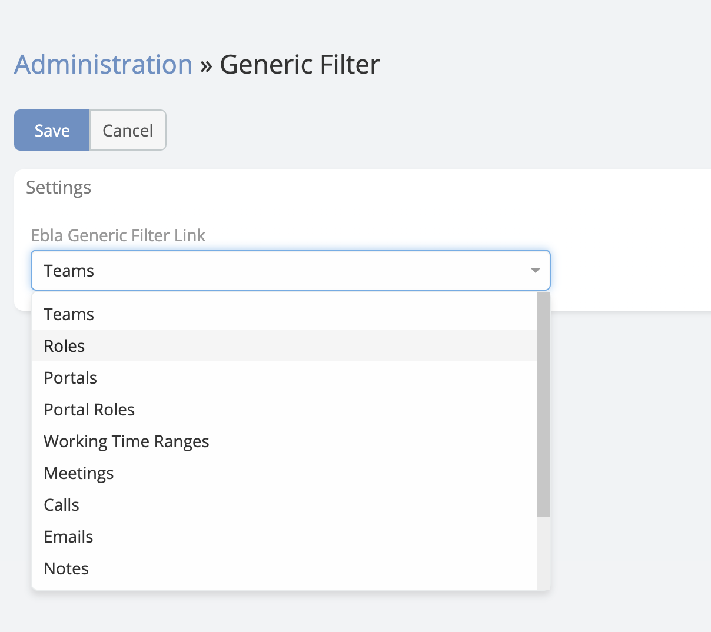

# Ebla Generic Filter 

> The **Ebla Generic Filter** extension adds a powerful global filtering layer to EspoCRM. It places a dropdown menu in the navigation bar, allowing users to filter *all* list views based on a selected context (such as a specific Project, Team, or Organization) with a single click.

---

<iframe width="650" height="315" src="https://www.youtube.com/embed/P-LBd3PhjZg" frameborder="0" allow="accelerometer; autoplay; clipboard-write; encrypted-media; gyroscope; picture-in-picture" allowfullscreen></iframe>

---

## Features

### 1. Global Navbar Filter
A dropdown menu is added to the top navigation bar (next to the global search). This dropdown lists items relevant to the current user based on the configured relationship (e.g., "My Projects").

*   **Context Switching:** Users can select an item (e.g., "Project Alpha") to instantly filter all data in the CRM to show only records related to that project.
*   **Select All:** Users can select "Select All" to disable the filter and view all records.
*   **Quick Search:** If a user has many items (more than 12), a search box automatically appears within the dropdown for quick access.
*   **Persistent Selection:** The selected filter is saved to the user's preferences, so it persists across sessions.

### 2. Automatic List Filtering
When a filter is active (e.g., "Project Alpha" is selected), the extension automatically intercepts database queries for list views.

*   **Universal Application:** Any entity that has a relationship to the filter entity (e.g., a "Task" related to a "Project") will be automatically filtered.
*   **Smart Detection:** The extension intelligently detects relationships (both `belongsTo` and `manyMany`) and applies the correct filter logic.
*   **Opt-Out:** Developers can exclude specific relationships from this behavior using metadata parameters (`skipGf: true`).

### 3. Automatic Field Population
When creating new records while a filter is active, relevant fields are automatically populated.

*   **Smart Defaults:** If you have "Project Alpha" selected and click to create a new "Task", the "Project" field on the Task creation form will automatically be set to "Project Alpha".
*   **Dynamic Updates:** Changing the global filter while a creation form is open will dynamically update the field value.

## Configuration

To configure the extension, go to **Administration > Generic Filter Settings**.

### General Settings

*   **Ebla Generic Filter Link:** Select the User relationship that will drive the filter.
    *   This dropdown lists all `hasMany` relationships on the User entity (e.g., `Teams`, `Projects` if you have a Project link on User).
    *   *Default:* `teams`

## How It Works

1.  **Selection:** The administrator selects a "Link" (e.g., `Projects`) in the settings.
2.  **User Context:** The extension looks at the *current user's* related records for that link (e.g., "My Projects").
3.  **Dropdown:** These records are populated in the navbar dropdown.
4.  **Application:** When a user selects "Project A":
    *   The system sets "Project A" as the active context.
    *   When the user navigates to "Tasks", the system checks if "Tasks" are related to "Projects".
    *   If yes, it adds a `WHERE project_id = 'Project A'` clause to the query.

## ChangeLog

