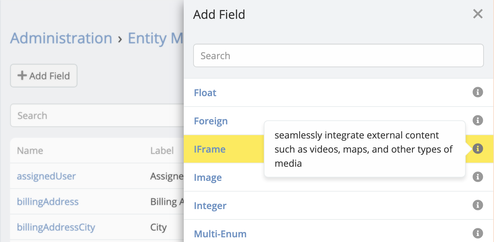
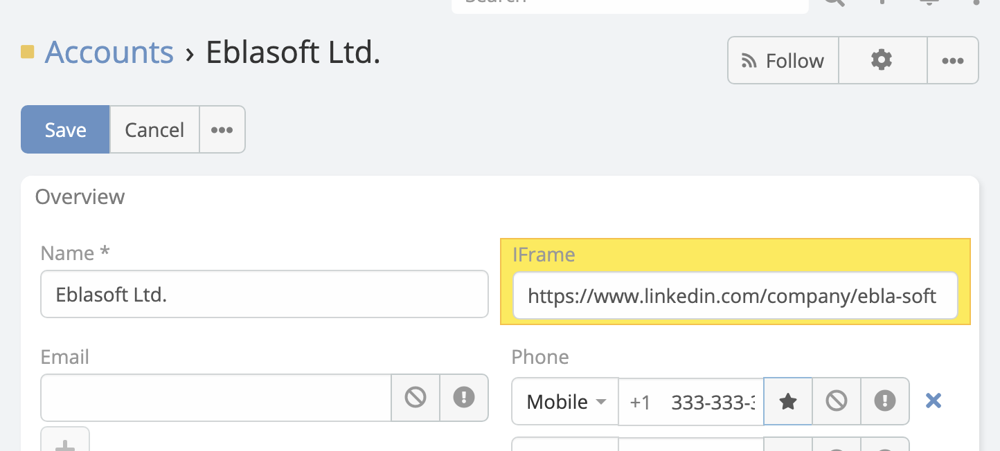
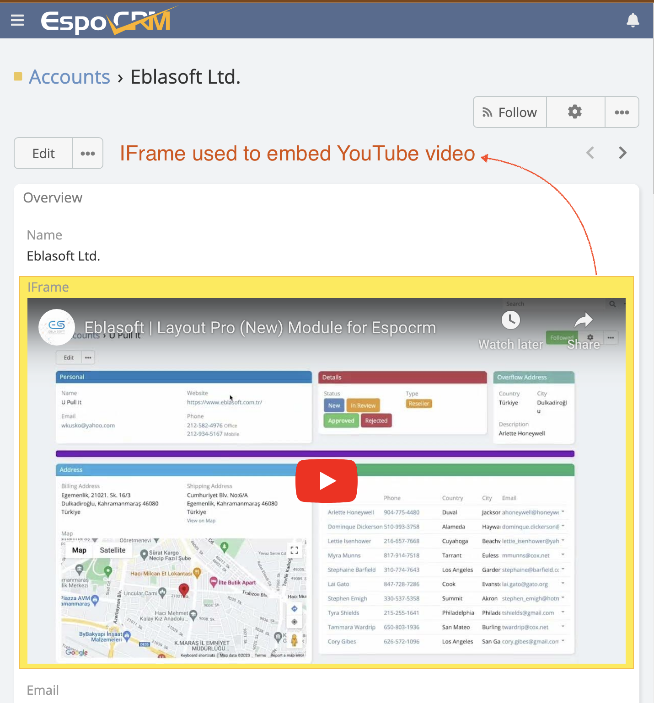
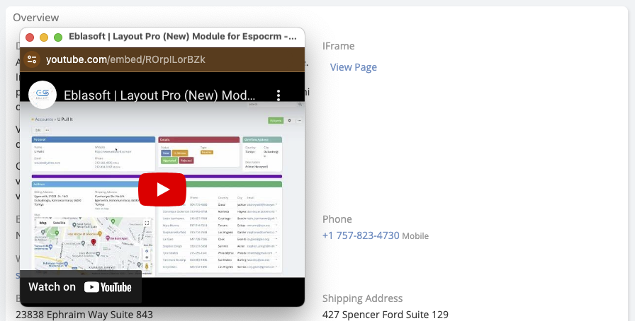

# Espocrm Iframe Documentation 

## Overview
**Ebla Iframe** adds new field type to EspoCRM "Iframe Field". It allows you to embed external web content into EspoCRM detail views.

## Edit View
Just like `url` field type, you will be able to input the URL of the page you want to embed. URL also can be set by a formula.

## Detail View
Based on the [mode](#modes) you selected, the iframe will be displayed in different ways.

## Options
- **Height**: Height of the iframe in pixels.
- **Button Label**: Label of the button, this only needed if mode is set to `popup` or `new-tab`.
- **[Mode](#modes)**.

## Modes
See this video for a quick overview of the modes:

<iframe width="560" height="315" src="https://www.youtube.com/embed/n7S4V7DdW-8?si=sHcA15zTk9A" title="Eblasoft | Espocrm Shared Filter" frameborder="0" allow="accelerometer; autoplay; clipboard-write; encrypted-media; gyroscope; picture-in-picture; web-share" referrerpolicy="strict-origin-when-cross-origin" allowfullscreen></iframe>

### Inline
Display the iframe directly in the detail view.

### Popup Window
Display as button, click to open the iframe in a modal window inside EspoCRM.

### New Tab
Display as button, click to open the iframe in a new tab.

## Change Log

