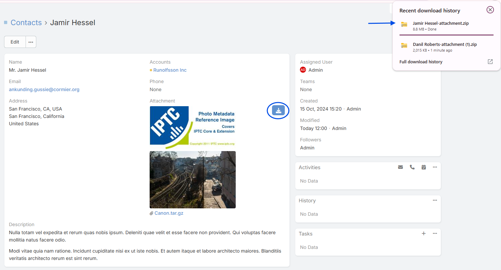

# EspoCRM Image Plus Documentation 

## Overview
**Ebla Image Plus** enhances EspoCRM’s attachment and image handling by adding powerful metadata extraction, translation, and bulk processing features. It is designed for users who need better control, visibility, and organization of image data inside EspoCRM.

With this extension, you can extract and display **EXIF** and **IPTC** metadata, translate technical tags into readable labels, and manage image information more efficiently—making it ideal for industries like **real estate**, **media**, **documentation**, and **digital asset management**.

If you work with a lot of images in EspoCRM and need better metadata control, **Ebla Image Plus** is the perfect solution.

---

<iframe width="560" height="315" src="https://www.youtube.com/embed/MZvQ2UdnBAw?si=wUJ5Xphbk5aMZFco" title="YouTube video player" frameborder="0" allow="accelerometer; autoplay; clipboard-write; encrypted-media; gyroscope; picture-in-picture; web-share" referrerpolicy="strict-origin-when-cross-origin" allowfullscreen></iframe>

## Key Features

### EXIF & IPTC Metadata Extraction
Automatically extract and display embedded metadata from image files.

This includes:
- Camera model
- Capture date
- Exposure settings
- Orientation
- GPS (if available)
- Copyright & author info (IPTC)
- And more

This allows you to understand your image data without leaving EspoCRM.

---

### Human-Readable EXIF Labels
Technical EXIF keys are translated into clear, user-friendly labels.

Instead of seeing:
- ExposureTime
- ISOSpeedRatings
- FNumber

You will see:
- Exposure Time
- ISO Speed
- Aperture

This makes metadata understandable for non-technical users.

---

### German Translation for EXIF Data
Ebla Image Plus includes built-in **German translations** for EXIF metadata labels.

This is especially useful for:
- German-speaking teams
- International companies
- Localization requirements

---

### Mass Action: Bulk Metadata Sync
Sync metadata for multiple images at once using a **mass action**.

This is useful when:
- You upload many images
- You migrate old records
- You update metadata logic
- You fix previously missing data

#### How It Works:
1. Go to the attachment or related entity list.
2. Select multiple image records.
3. Choose **Sync Image Metadata** from the mass actions menu.
4. The system will re-extract and update metadata for all selected images.

---

### Download Multiple Attachments as ZIP
Download multiple attachments at once as a single ZIP file.

This feature:
- Saves time
- Keeps files organized
- Is perfect for exports, backups, and sharing

---

### Improved Handling of Undefined Tags
Some images contain incomplete or non-standard metadata.

Ebla Image Plus:
- Safely handles undefined tags
- Prevents UI errors
- Displays fallback values
- Keeps the interface clean and stable

This ensures reliability even with poorly formatted images.

---

### PDF Image Helper – Custom Size Parameter
The PDF image helper now supports a custom `size` parameter.

This allows:
- Better control of image rendering
- Proper scaling inside PDFs
- More professional document layouts

Perfect for:
- Brochures
- Property sheets
- Reports
- Contracts

---

### Improved Module Naming & Descriptions
Better naming and clearer descriptions have been added across the module to improve:

- Usability
- Discoverability
- Admin configuration clarity
- User understanding

---

## Ideal For

Ebla Image Plus is especially useful for:

- 🏠 Real estate companies
- 📰 Media & journalism
- 🗂 Digital asset management
- 📸 Photography workflows
- 🏢 Documentation-heavy businesses

---

## Notes

!!! note "Permissions & Access"
Metadata visibility respects EspoCRM field permissions and ACL rules.

!!! warning "Source Dependency"
Metadata availability depends on the image file itself. If the image does not contain EXIF or IPTC data, those fields will remain empty.

---

## Change Log

