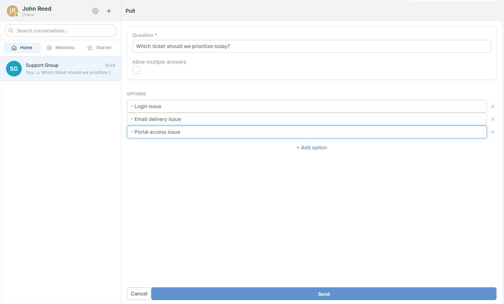
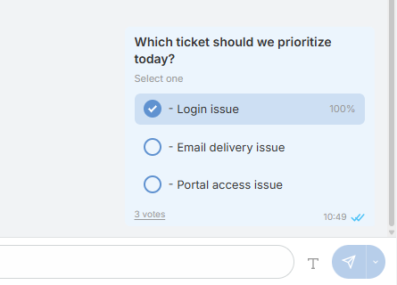
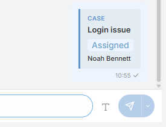
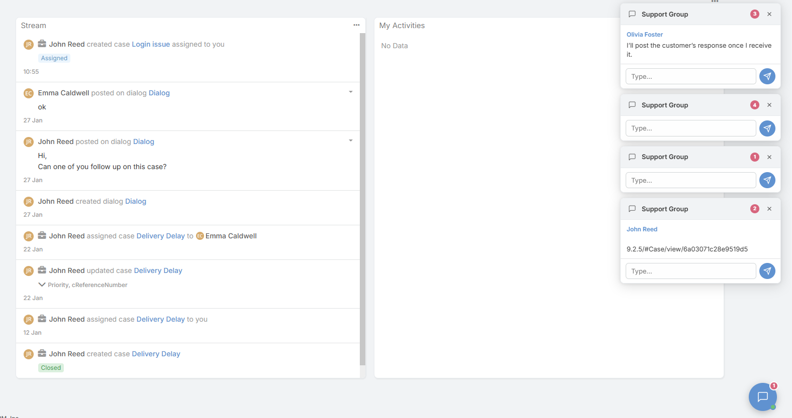
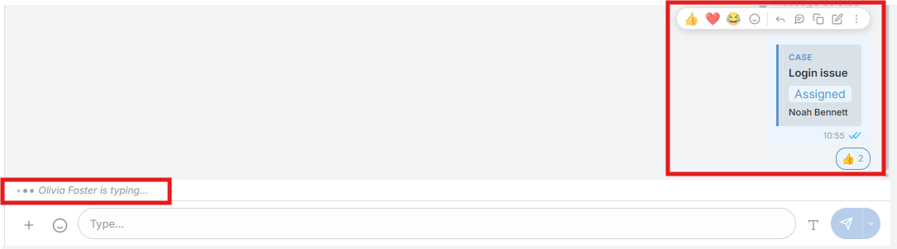

# Collaboration Features

Beyond basic messaging, Internal Chat adds a set of collaboration tools that keep follow-up work inside EspoCRM instead of moving it to another system.

---

## Threads

Internal Chat supports **Google-Chat-style threads**. Replies live under a root message, while the main room shows the root message together with its reply count.

This keeps side discussions attached to the original message without filling the main timeline.

---

## Polls and Scheduled Messages

- Create poll messages with single-answer or multiple-answer voting.
- Schedule messages for later using quick presets or a custom date and time.
- Review scheduled items from the dedicated **Scheduled** shortcut.
- Edit, reschedule, send now, or cancel scheduled messages before they are sent.

These workflows are controlled from `Administration => Internal Chat`.

---

## Record and Link Previews

- Internal EspoCRM record links can render preview cards inside chat.
- External `http` and `https` links can render preview cards from page metadata.
- The composer can also offer an **Event** action that opens the EspoCRM calendar dialog and posts the saved event link back to the room.

Record previews respect ACL. Users without access do not see the record details.

---

## Presence and Notifications

- Presence states: **online**, **busy**, **away**, and **offline**
- Custom emoji + text statuses with optional expiry
- Typing indicators
- Read receipts
- Sound notifications
- Browser notifications
- In-app popup notifications

Users can also adjust floating-widget visibility, badge animation, list density, popup mode, and emoji skin tone from the chat settings screen.

---

## Portal Support and Notes

Portal users can access Internal Chat when portal support is enabled in `Administration => Internal Chat`.

Notes:

- GIF search requires a configured Klipy API key.
- Scheduled sending and automatic custom-status expiry depend on EspoCRM scheduled jobs.
- The Event action also depends on the user having permission to create calendar events.
- The code clearly supports portal chat access, but popup notifications are defined separately and are not documented here as a portal-specific feature.

---

## See Also

- [Internal Chat Overview](index.md)
- [Conversations & Messaging](conversations-and-messaging.md)
- [Administration](administration.md)
