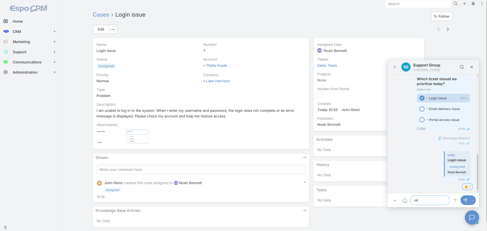
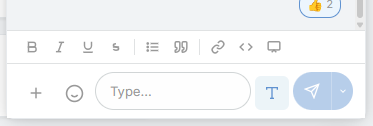
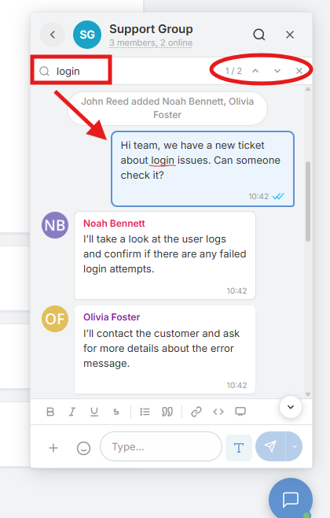
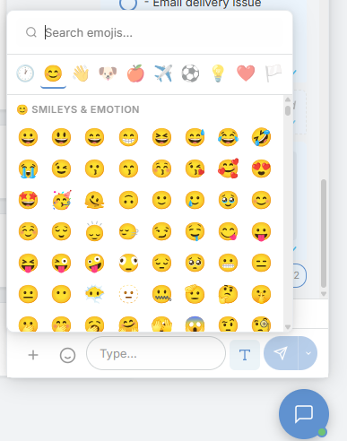
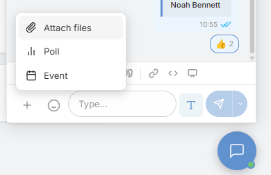
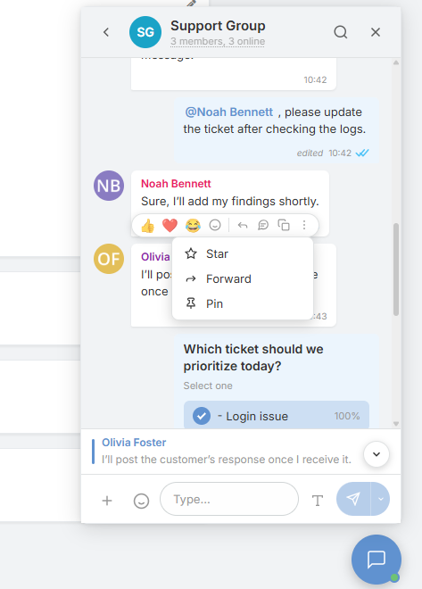
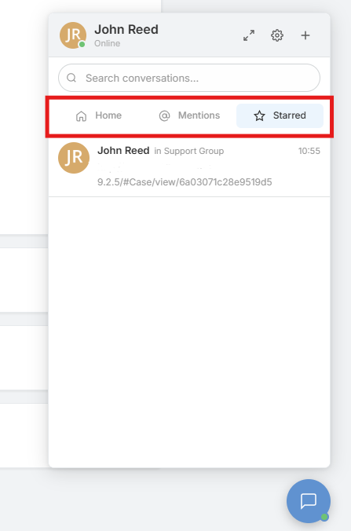

# Conversations & Messaging

Internal Chat uses the same room model in both the floating widget and the full-page `/#InternalChat` view, so users can move between quick chat and full-screen work without changing context.

---

## Conversations

- Start **direct chats** from the new conversation screen.
- Create **group chats** with selected members.
- When enabled, the new group flow can include **portal users** and a **Teams** tab for bulk-adding team members.
- Group chats support rename, member management, admin assignment, and leave actions.
- Rooms can be pinned, muted, hidden, marked unread, unhidden, or deleted where permitted.
- Hidden rooms reappear automatically when a new message arrives.

Most conversation controls are managed from `Administration => Internal Chat`.

---

## Composer

- Rich-text controls for bold, italic, underline, strikethrough, lists, quotes, links, and code.
- Attachments by file picker, drag-and-drop, and paste.
- Emoji picker, emoji autocomplete, and quick reactions.
- Optional GIF picker.
- Optional insert-from-source menu for configured attachment sources.
- In-room message search with result navigation and highlighting.

Attachment limits, allowed file types, and related toggles are configured from `Administration => Internal Chat`.

---

## Message Actions

- React to messages with emoji.
- Reply with a quoted preview.
- Forward messages to another conversation.
- Copy message text.
- Star messages for quick access later.
- Pin important messages inside a room.
- Edit or delete your own messages within the configured grace period.

These actions can be enabled or disabled from `Administration => Internal Chat`, and edit or delete limits are enforced by the backend.

---

## Room List

The room list supports shortcut views for **Mentions**, **Starred**, **Unread**, **Groups**, **Archive**, and **Scheduled**. It also shows unread counts, mention badges, pinned rooms, muted rooms, and conversation search.

Pinned conversations are limited per user, and the code currently enforces a maximum of 3 pinned rooms.

---

## See Also

- [Internal Chat Overview](index.md)
- [Collaboration Features](collaboration-features.md)
- [Administration](administration.md)
