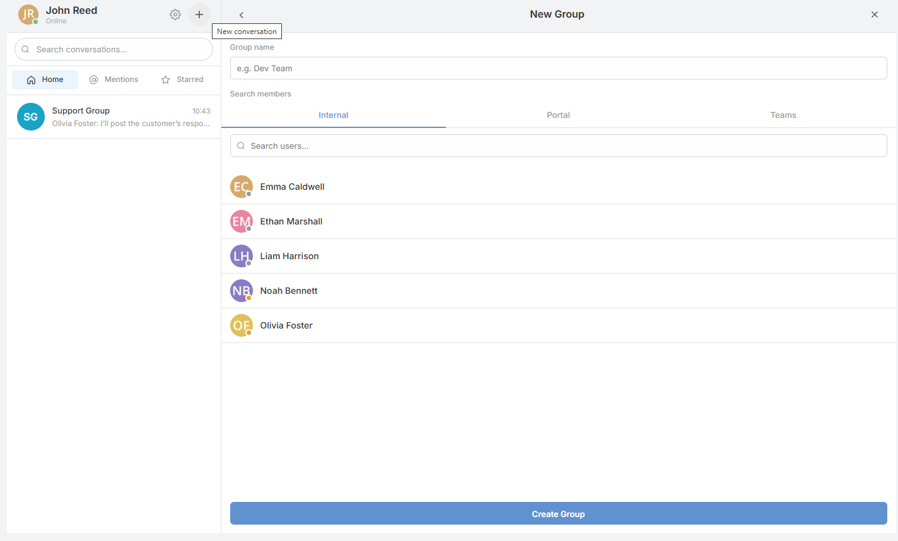
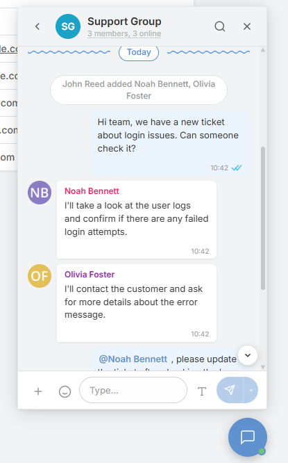

# Internal Chat

<!-- DOC:OVERVIEW START -->

## Overview

**Internal Chat** adds an embedded chat workspace to EspoCRM with a floating widget and a full-page view at `/#InternalChat`. It supports direct and group conversations, attachments, reactions, replies, forwards, threads, polls, scheduled messages, presence, and optional portal access, while keeping the data inside EspoCRM.

The extension works without an external chat service. Klipy is optional and only used for GIF search. The package also includes translations for 26 languages.

<!-- DOC:OVERVIEW END -->

---

<!-- DOC:FEATURES START -->

## Key Features

- **Direct and Group Chat**: Start one-to-one conversations, create group chats, and optionally build groups from EspoCRM teams.
- **Chat Workspace**: Use the floating widget from anywhere or switch to the full-page `/#InternalChat` view.
- **Rich Messaging**: Send formatted messages with attachments, emoji, mentions, replies, forwards, pins, and message search.
- **Collaboration Tools**: Use threads, polls, scheduled messages, record previews, and link previews inside chat.
- **Presence and Notifications**: Track presence, custom statuses, typing indicators, read receipts, and message notifications.
- **Admin Control**: Manage access, limits, polling, and feature toggles from `Administration => Internal Chat`.

<!-- DOC:FEATURES END -->

---

<!-- DOC:USAGE START -->

## Table of Contents

- [Conversations & Messaging](conversations-and-messaging.md) - Main chat UI, direct and group conversations, group management, composer behavior, attachments, and message actions.
- [Collaboration Features](collaboration-features.md) - Threads, polls, scheduled messages, previews, presence, notifications, and portal support notes.
- [Administration](administration.md) - Access modes, settings groups, limits, user preferences, optional integrations, and operational notes.

<!-- DOC:USAGE END -->

---

## Requires

- EspoCRM >= 8.0.0
- PHP >= 8.1

---

## Installation

1. Download the extension package.
2. Upload it from `Administration => Extensions`.
3. Open `Administration => Internal Chat` to review access, limits, and enabled features.
4. If you want GIF search, configure `Administration => Integrations => Klipy`.
5. Make sure EspoCRM scheduled jobs are running for scheduled messages and automatic custom-status expiry.

The installer registers the required Internal Chat scheduled jobs automatically.
