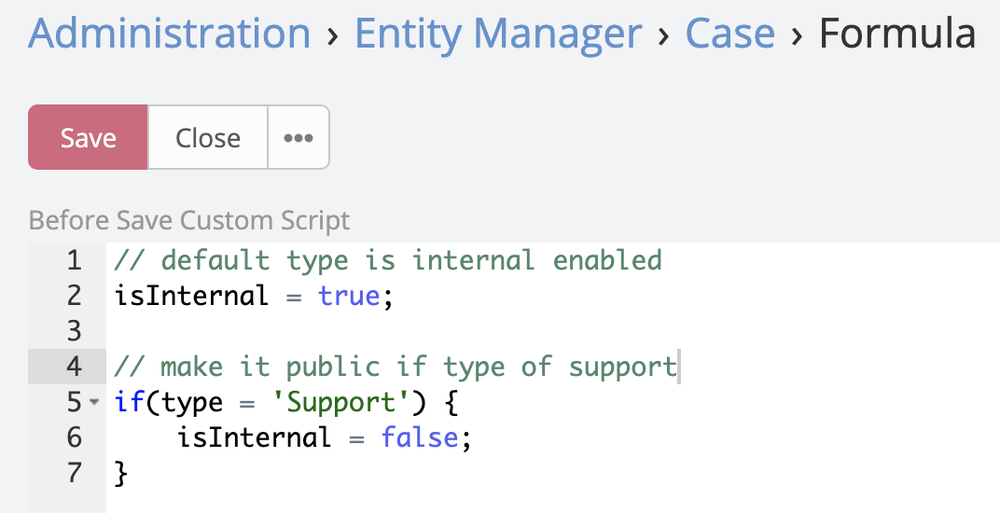
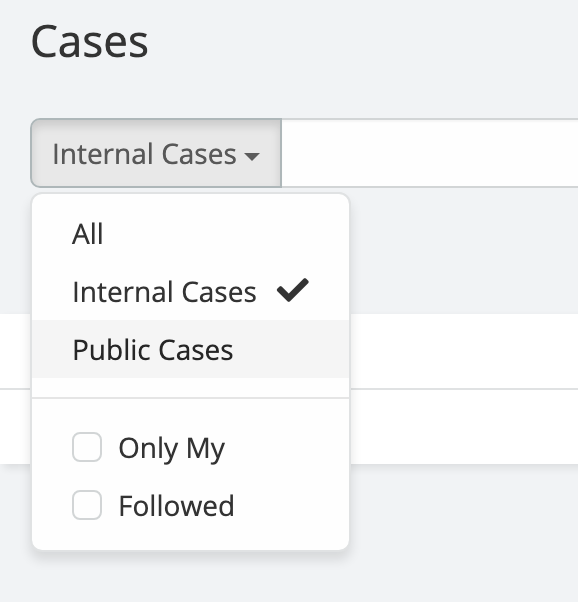
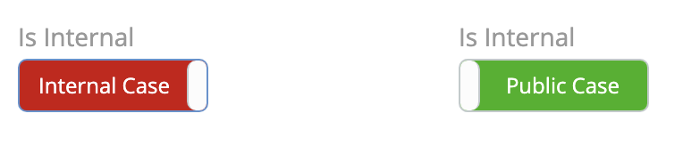

# Ebla Internal & Public Case Extension 

## Overview

Ability to hide Case from portals & stop (emails | in-app) notifications, adds control field named "Is Internal" with preset filters.

## Features

### Is Internal Field:

A new boolean field `isInternal` is added to the Case entity.

- If **true** (checked), the Case will be hidden from all portal users.
- If **false** (unchecked), the Case will behave as per the default EspoCRM configuration, and portal users will have access to it.

### Reversible:

The extension is reversible, meaning that you can anytime easily switch a case from internal to public and vice versa.

### Custom Logic via Formula:

Administrators can control the `isInternal` field using EspoCRM's formula system. This allows for custom logic to automatically determine whether a case should be marked as
internal or public.

{width=auto}

### Predefined Filters:

The extension provides two preset filters for easy case management:

- Public Cases.
- Internal Cases.

{width=300px}

### Switch Button Configuration:

A switch button configuration is already set up for the `isInternal` field. If you used [Ebla Switch Extension](https://docs.eblasoft.com.tr/espocrm-extensions/switch/).

{width=400}

## Installation

1. Download the **Ebla Internal Case** extension package from Eblasoft.
2. In EspoCRM, navigate to **Administration** > **Extensions**.
3. Click on **Install** and upload the extension package.
4. Once installed, you will see the **Is Internal** field added to the Case entity field manager.
5. You can also add the **Is Internal** field to the Case layout or manage it internally by formula.
