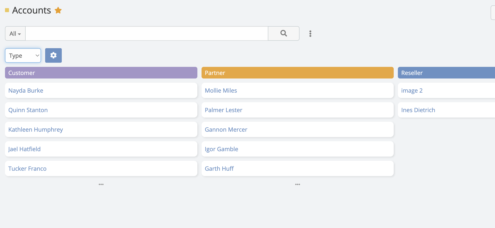

# Kanban Multiple  

> Ability of switching between fields in kanban view in EspoCRM is available
> in [Ebla Kanban Multiple](https://www.eblasoft.com.tr/espocrm-extension-page/espocrm-kanban-multiple).

---

---

**-** Go to **Administration** -> **Entity Manager** -> **{Entity Type}** -> **Kanban Status Fields** .

## ChangeLog

