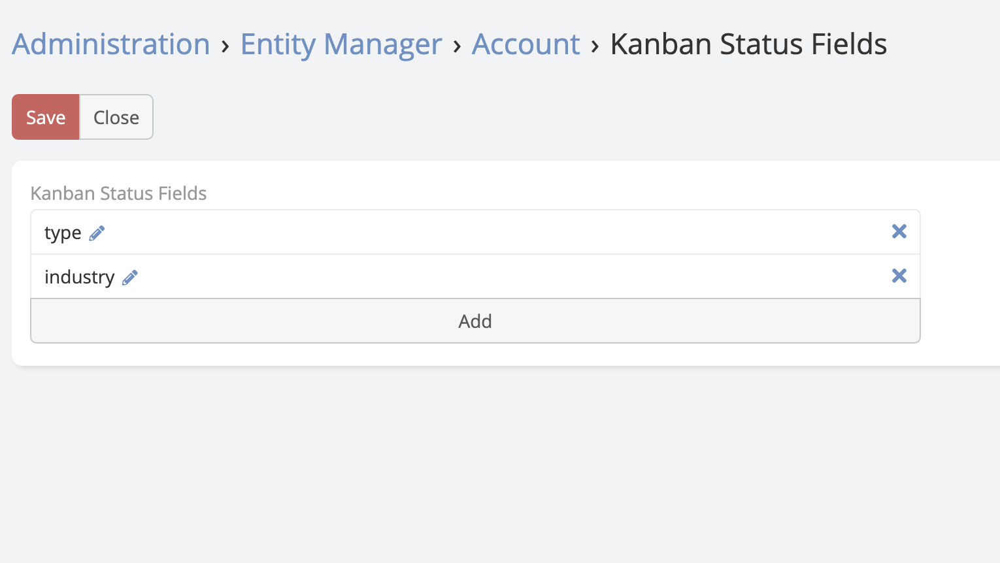

# Kanban Multiple  

> Ability of switching between fields in kanban view in EspoCRM is available
> in [Ebla Kanban Multiple](https://www.eblasoft.com.tr/espocrm-extension-page/espocrm-kanban-multiple).

---

## Extension video
<iframe width="560" height="315" src="https://www.youtube.com/embed/yvO742oWN6A" title="Eblasoft | Espocrm Kanban Multiple" frameborder="0" allow="accelerometer; autoplay; clipboard-write; encrypted-media; gyroscope; picture-in-picture; web-share" referrerpolicy="strict-origin-when-cross-origin" allowfullscreen></iframe>

---

## Overview
The **EblaKanbanMultiple** extension for EspoCRM enhances the Kanban view functionality by allowing users to switch between different grouping fields (status fields) dynamically for a single entity. This is particularly useful for entities that track progress through multiple dimensions (e.g., Sales Stage vs. Lead Status).

---

## Features
- **Dynamic Kanban Grouping**: Switch the Kanban column grouping field via a dropdown menu in the view header.
- **Configurable Fields**: Administrators can define which fields are available for grouping per entity.
- **Customizable Columns**: Configure ignored status options for each field independently.

---

## Configuration
To enable the multiple Kanban functionality for an entity (e.g., Opportunity, Task)

**-** Go to **Administration** -> **Entity Manager** -> **{Entity Type}** -> **Kanban Status Fields** .

**-** Select the fields you want to be available for Kanban grouping from the list.

**-** If you want to exclude specific values for any field, click on the Edit (pencil) icon. A modal will appear where you can select the values to be ignored.

---

## Usage
1.  Navigate to the list view of the configured entity.
2.  Switch to **Kanban** view mode (if not already active).
3.  In the top-left corner of the Kanban board, you will see a dropdown menu displaying the current grouping field (e.g., "Stage").
4.  Click the dropdown and select a different field (e.g., "Lead Source").
5.  The Kanban board will reload, displaying columns based on the selected field's options.

---
## ChangeLog

