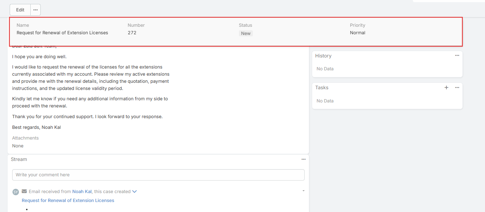
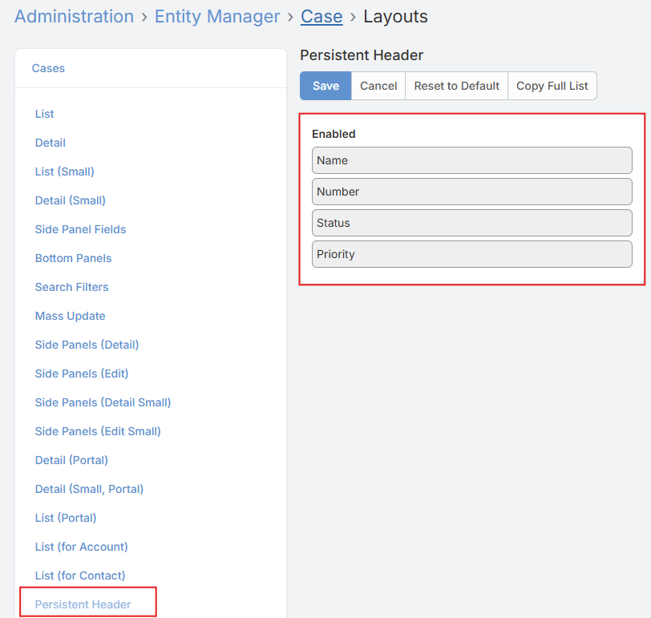
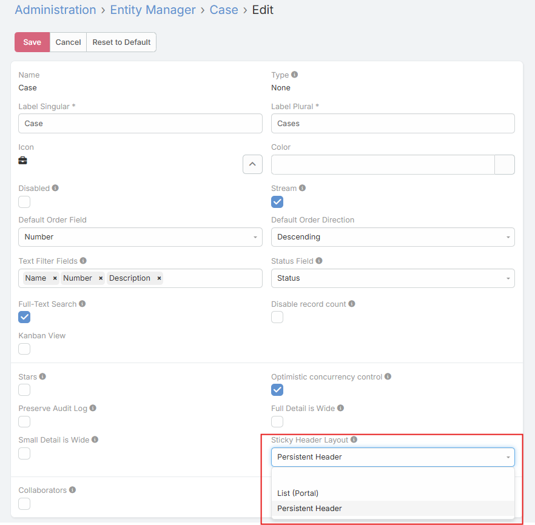

# Sticky Header Layout

## Overview

The **Sticky Header** feature enhances navigation and usability within entity detail views by displaying a fixed panel of key field values at the top of the screen as the user scrolls. This allows important record information to remain visible at all times, without the need to scroll back to the top of the page.

---

## Setup Guide

### Step 1 — Create or Select a Layout

Navigate to the Entity Manager layouts section for the target entity:

> **Administration → Entity Manager → `{entityType}` → Layouts**

- Create a new **List Layout**.
- ⚠️ The **default List Layout** and the **Small List Layout** are **not** eligible for use as a Sticky Header layout — only additional list layouts can be assigned.
- Configure the layout to include the fields you want to be visible in the sticky header panel.

---

### Step 2 — Assign the Layout to the Entity

Navigate to the entity's edit settings:

> **Administration → Entity Manager → `{entityType}` → Edit**

- Locate the **Sticky Header Layout** field.
- Select the layout created or chosen in Step 1.
- Save the changes.

---

## How It Works

Once configured, visit any record of the target entity type. As you scroll down the detail view, a **fixed panel** will appear at the top of the screen, displaying the fields defined in the assigned layout.

The panel:
- Appears automatically after scrolling past the initial view
- Fades in and out smoothly based on scroll position
- Stays aligned with the record grid width
- Displays field values in **read-only** mode
- Updates dynamically if field values change during the session

---

## Notes

- Only **Additional List Layouts** (not the default or small list layouts) are supported as Sticky Header layouts.
- The sticky panel is purely informational and does not allow editing.
- Layout changes take effect immediately after saving the entity configuration.
