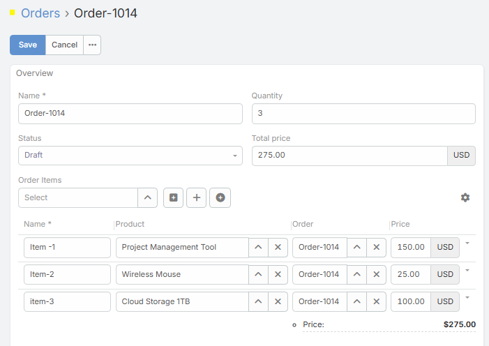
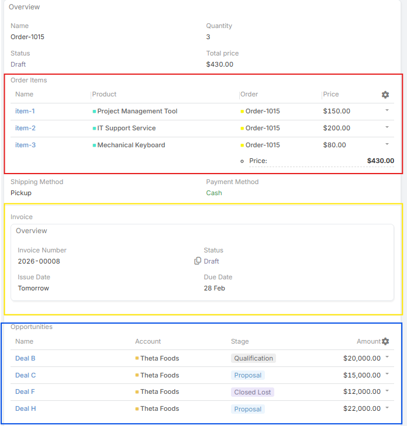
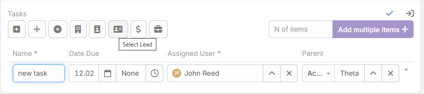
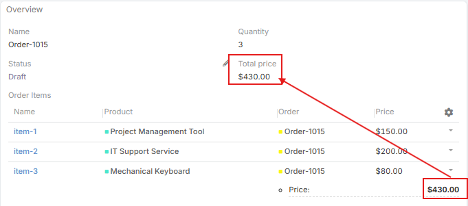
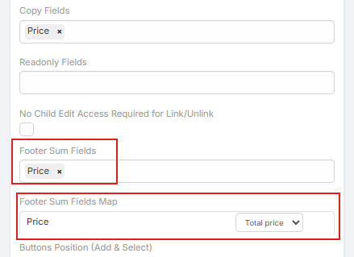

# Ebla Multiple Link Pro 

## Overview

**Ebla Multiple Link Pro** upgrades standard "Link Multiple" and "Link One" fields by rendering them as interactive lists inside the record view. Instead of simple tags, linked records appear in a full grid supporting inline editing, custom layouts, footer calculations, and direct record creation.

The extension adapts its features based on the link type:

* **Link-One:** Only **Enable Form** and layout options are shown. The field displays the full linked record with all its fields.
* **Many-to-Many:** Shows Enable Form, Row Action Items, and both the parent and layout fields.
* **One-to-Many:** This is the most feature-rich mode. All options are available, including **Enable Form**, **Row Actions**, **Copy Fields**, **Footer Sum Fields**, and **Mapping**. Crucially, **this relationship type supports the "Middle Entity" configuration**, making it ideal for managing complex relationships that require extra attributes (like "Order Items" in an Order).

---
## Key Features

### Inline List View & Editing

* Replace default link view with a detailed list.
* Edit linked record fields directly in the list without opening the target entity.
* Supports Link-One, One-to-Many, and Many-to-Many.

!!! note

     Many-to-Many relationships do not support inline editing. they display linked records as a list with available actions (e.g., view, edit, unlink) but require users to open the linked record or the middle entity for editing.

### Middle Entity Support (Via One-to-Many)

* **Advanced Relationship Handling:** Utilize a **One-to-Many** relationship to function as a Middle Entity (Junction) between two other records.
* **Attributes Support:** Perfect for scenarios requiring extra data on the link (e.g., Quantity, Price, Discount).
* **Parent Link (Polymorphic) Support:**
  * Supports "Parent" fields (fields that can relate to multiple entity types like Account, Contact, Opportunity).
  * If the Middle Link is a Parent field, the extension automatically detects all allowed entity types.
* **Transparent Navigation:** Configure whether clicking a row opens the Middle Entity or the Target Entity.
* **Unique Links:** Prevent duplicate pairs of linked records.

**Example (Standard):**
* **Order** has a One-to-Many with **Order Item**.
* **Product** has a One-to-Many with **Order Item**.
* **Order Item** acts as the Middle Entity linking Orders and Products.

**Example (Parent Link):**
* **Order** has a One-to-Many with **Task**.
* **Task** has a `Parent` field (related to Account, Contact, Opportunity, etc.).
* Configuring the Task's `Parent` field as the Middle Link will automatically generate separate buttons: **Select Account**, **Select Contact**, **Select Opportunity**.

### Dynamic Field Logic

* Apply rules for visibility, required status, or read-only state per row based on other field values.

### Footer Calculations

* Automatically sum numeric fields at the bottom of the list.
* Map totals to parent entity fields (e.g., Order Item.Total → Order.Total).
* Ideal for financial or quantity tracking.

### Flexible Layouts & Actions

* **Custom Columns:** Define which fields appear in the list.
* **Row Actions:** Configure actions (`view`, `edit`, `unlink`, `remove`) for each row.
* **Display Modes:** Inline list, modal popup, or full-page list.

### Direct Record Creation & Selection

* **Enable Select:** Link existing records.
* **Multi-Entity Select:** When using a **Parent Link** as a Middle Entity, distinct "Select" buttons appear for each allowed entity type (e.g., *Select Account*, *Select Lead*).
* **Enable Add:** Create new linked records directly from the parent record.
* **Enable Add Multiple:** Select multiple records at once.
* **Link-One Direct Creation:** Create Link-One records without leaving the parent record.
* **Create in Modal:** Open forms in a popup instead of a new page.
---
## Field Settings

### General Settings

* **Enable Form:** Activate Ebla Link Pro for the field.
* **Layout / Edit Layout / Custom Layout:** Configure display and inline editing layouts.

### Relationship Settings

* **Middle Entity:** Select the junction entity (available when configuring One-to-Many relationships).
* **Parent Link Support:** If the selected Middle Entity field is a `Parent` type, dynamic selection buttons are enabled automatically.
* **Open Middle Entity:** Configure navigation when clicking a row.
* **No Edit Access Required for Unlink:** Allow unlinking without edit permission.

### Data & Calculations

* **Copy Fields:** Copy fields from linked record to junction or parent entity.
* **Read-Only Fields:** Fields that cannot be edited inline.
* **Footer Sum Fields & Map:** Sum numeric fields and map totals to parent entity fields.

### Display & Actions

* **Row Action Items:** Select available actions per row.
* **Buttons Position:** Top or bottom.
* **Order By / Order:** Default sorting field and direction.