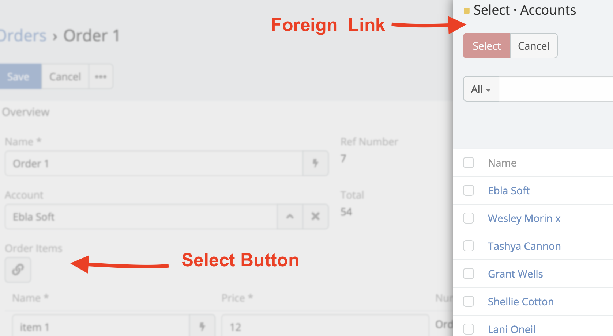
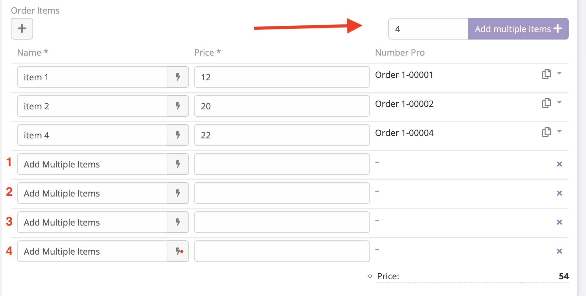

# Ebla Link Pro 

## Overview

**Ebla Link Pro** turns standard EspoCRM relationship fields into richer record screens. Link Multiple fields can be shown as inline lists with configurable columns, row actions, inline editing, footer totals, quick creation, and selection buttons. Link One fields can be shown as an embedded form for the linked record.

Use it when users need to work with related records without leaving the parent record. Common examples include order items on an order, invoice lines on an invoice, products on a quote, or any child records that should be created and maintained inside the parent detail view.

---

## Requirements

* EspoCRM 9.3 or later.
* PHP 8.1 or later.
* The field must be configured in **Administration** > **Entity Manager** > the target entity > **Fields**.

After changing field settings, rebuild EspoCRM metadata if the system does not apply the change immediately.

---

## Relationship Support

### Link One

For Link One fields, enable the form to display the linked record directly inside the parent record. You can choose the detail layout and edit layout used for the embedded record.

This is useful for one-to-one details where the linked record should feel like part of the parent form.

### One-to-Many

One-to-Many relationships provide the full inline list experience:

* Add rows directly from the parent record.
* Edit child record fields inline.
* Select existing records when enabled.
* Create records in a modal when enabled.
* Configure row actions such as view, edit, unlink, and remove.
* Calculate footer totals and map them back to parent fields.
* Use a manual custom order field for drag-and-drop sorting.

### Many-to-Many

Many-to-Many fields can be displayed as a related list and can use available actions such as view, edit, unlink, and remove. Inline editing is not supported for Many-to-Many fields; users open the linked record or the related middle record to edit its data.

---

## Middle Entity Setup

Use **Middle Link** when a One-to-Many child entity acts as the junction between the parent record and another target record.

Example:

* **Order** has many **Order Items**.
* **Order Item** links to **Product**.
* The Order record displays Order Items inline, while each row can point to a Product.

This pattern is useful when the relationship needs its own fields, such as quantity, price, discount, notes, or custom status.

Middle Entity options:

* **Middle Link** selects the field on the child entity that points to the target record.
* **Is Middle Link Unique** prevents selecting the same target record more than once.
* **Open Middle Entity** controls whether row clicks open the child record or the target record.
* **Copy Fields** copies selected values from the target record into the child record when selecting.

### Parent Link Middle Fields

If the selected middle field is a Parent field, Link Pro detects the allowed parent entity types and shows separate select buttons for each type, such as **Select Account**, **Select Contact**, or **Select Opportunity**.

---

## Footer Totals

Footer totals calculate numeric fields in the inline list. You can show totals under the list and map a total into a field on the parent record.

Example:

* Sum **Order Item > Amount**.
* Map the result to **Order > Total Amount**.
* The parent field updates while users edit rows.

---

## List Display Mode

For Link Multiple fields shown in list views, choose how related records are represented:

* **Default** shows linked record names.
* **Modal List** shows a link that opens related records in a modal list.
* **Full Page List** opens the standard related-record list page.

---

## Field Settings

Open **Administration** > **Entity Manager** > your entity > **Fields**, then edit the Link One or Link Multiple field.

### Basic Settings

* **Enable Form** activates Link Pro behavior for the field.
* **Detail Layout** selects the layout used in detail mode.
* **Edit Layout** selects the layout used in edit mode.
* **Custom Layout** lets you define the displayed columns for the inline list.

### Buttons

* **Enable Select Button** lets users select existing records.
* **Enable Add Row Button** lets users add a new inline row.
* **Enable Create In Modal Button** opens a create form in a modal.
* **Enable Add Multiple Button** lets users add more than one record from the selector.
* **Buttons Position** places add and select buttons at the top or bottom of the field.

### Row Behavior

* **Row Action Items** controls available actions: view, edit, unlink, and remove.
* **Readonly Fields** keeps selected child fields visible but not editable inline.
* **No Child Edit Access Required for Link/Unlink** allows unlinking without edit access to the child record.
* **Order By** and **Order Direction** set default list sorting.
* **Custom Order** uses an integer, float, or autoincrement field for manual drag-and-drop order. When enabled, it replaces Order By and Order Direction.

### Data Mapping

* **Copy Fields** copies values from selected target records into the inline child row.
* **Footer Sum Fields** selects numeric fields to total.
* **Footer Sum Fields Map** maps calculated totals into parent record fields.

---

## Dynamic Logic

Inline rows respect field dynamic logic for visibility, required state, and read-only state. This lets each row react to its own values while users edit the parent record.

---

## Extension Video

<iframe width="650" height="315" src="https://www.youtube.com/embed/a-WviVKpBy4" frameborder="0" allow="accelerometer; autoplay; clipboard-write; encrypted-media; gyroscope; picture-in-picture" allowfullscreen></iframe>

---

## ChangeLog

