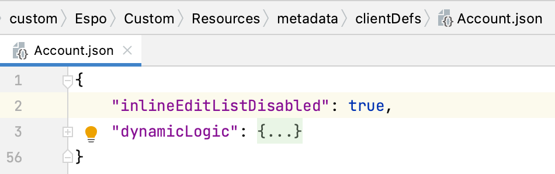

# Espocrm List Pro Documentation 

## Overview
**Ebla List Pro** for Espocrm makes editing your fields quicker & easier. With it, you can update fields directly in the list view, without needing to open separate pages for each item. This saves you clicks and time!

<iframe width="560" height="315" src="https://www.youtube.com/embed/4ucBksByszA" title="Eblasoft | Espocrm Shared Filter" frameborder="0" allow="accelerometer; autoplay; clipboard-write; encrypted-media; gyroscope; picture-in-picture; web-share" referrerpolicy="strict-origin-when-cross-origin" allowfullscreen></iframe>

## Key Features

### Inline Editing
Modify field values directly within the list view. Simply hover over a field, and a pencil icon will appear, prompting you to initiate the edit. Click on the pencil to activate editing.

### Escape and Save Shortcuts
Quickly discard or save your changes using keyboard shortcuts.

- Press ++esc++ to discard any changes made within the inline edit.
- Press ++ctrl+enter++ to save your changes.

### Entity-Level Disabling
Disable inline editing for specific entities by adding `"inlineEditListDisabled": true` within the corresponding JSON file located at `Resources/metadata/clientDefs/{YourEntityName}.json`.

### Field-Level Disabling
Deactivate inline editing for individual fields by toggling the "inline edit" option within the field manager configuration.

!!! note "Note"
    Inline editing respects field permissions and will not work for fields that are read-only or have restricted access.

!!! warning "Warning"
    Inline editing is not supported for fields that have dynamic logic.

### List Card View
Switch between the list view and card view to display records in a more visually appealing format.

### Real Estate Custom Advanced Card Style
Customize the card view to display additional fields and information.

### Propert Card No-İmage Place Holder
Set a default image to display when no image is available for a record.

## To Do

### Intuitive Keyboard Navigation
Navigate between cells using arrow keys (up, down, left, right) for a familiar and efficient data management experience similar to spreadsheet programs. This minimizes reliance on mouse clicks, fostering a more keyboard-centric workflow.

## Change Log

