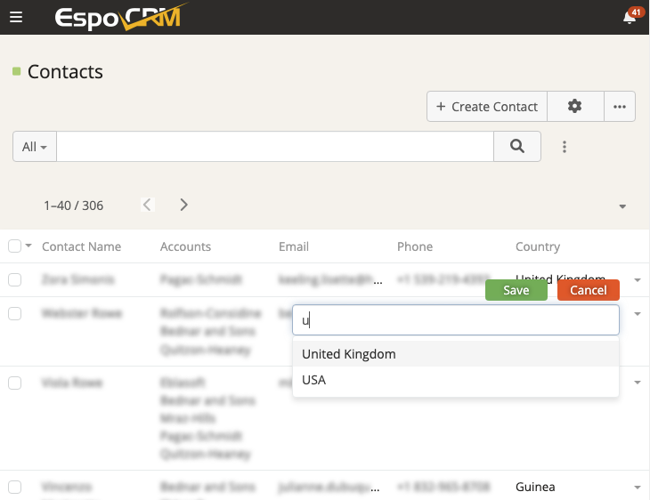

# Espocrm List Pro Documentation 

## Overview
**Ebla List Pro** for Espocrm makes editing your fields quicker & easier. With it, you can update fields directly in the list view, without needing to open separate pages for each item. This saves you clicks and time!

<iframe width="560" height="315" src="https://www.youtube.com/embed/VyTKrOHXMJQ" title="Eblasoft | Espocrm List Pro" frameborder="0" allow="accelerometer; autoplay; clipboard-write; encrypted-media; gyroscope; picture-in-picture; web-share" referrerpolicy="strict-origin-when-cross-origin" allowfullscreen></iframe>

## Key Features

### 1. Inline Editing

Modify field values directly within the list view.
- **Usage**: Hover over a field to see the pencil icon. Click to edit.
- **Shortcuts**:
    - `Esc`: Discard changes.
    - `Ctrl + Enter`: Save changes.
- **Configuration**:
    - Enable per-list in `Administration > Entity Manager > [Entity] > Layouts > List > Inline Edit`.
- **Note**: Respects field permissions. Not supported for fields with dynamic logic.

### 2. List Card View
Switch between the list view and card view to display records in a more visually appealing format.

- **Enable from**:
`Administration → Entity Manager→ {entityType} → Edit → Enable Card List View`

- **Set card view as default using**: Default View Mode As Card

- **Create a custom layout named**: *listCard* to control which fields appear inside each card.

### 3. Has Updates Highlight
Call attention to records that have new activity since the user last visited them.

- **Per-entity toggle**: In `Administration → Entity Manager → {Entity} → Edit`, enable **"Enable Has Updates Highlight"** to start tracking.
- **Accurate read tracking**: List Pro compares a user’s last record read timestamp with the entity’s `Stream Updated At`, `Modified At`, or `Created At` dates. Any newer activity keeps the row highlighted until the user opens the record again.
- **Immediate feedback**: Highlighted rows render with a bold label and subtle light-gray background, and clicking the record marks it as reviewed instantly so you’re never unsure whether you’ve covered the latest changes.

### 4. Real Estate Custom Advanced Card Style
Customize the card view to display additional fields and information.

### Propert Card No-İmage Place Holder
Set a default image to display when no image is available for a record.

## To Do

### Intuitive Keyboard Navigation
Navigate between cells using arrow keys (up, down, left, right) for a familiar and efficient data management experience similar to spreadsheet programs. This minimizes reliance on mouse clicks, fostering a more keyboard-centric workflow.

## Change Log

