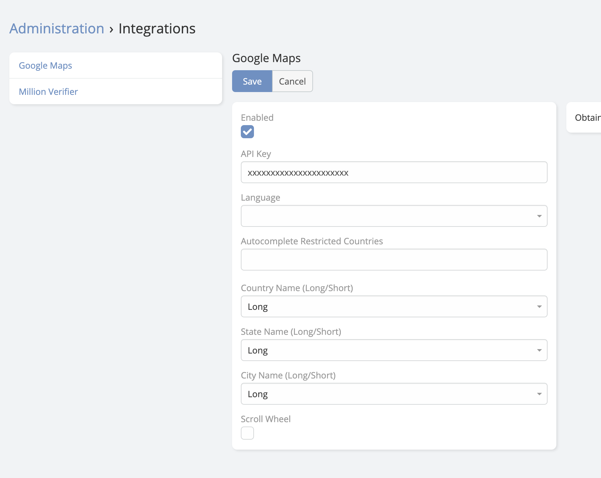

# Map Plus <a href="https://www.eblasoft.com.tr/espocrm-extension-page/espocrm-map-extension" target="_blank" id="ext-version" data-id="636c9732e830bebeb"></a>

<!-- DOC:OVERVIEW START -->

## Overview

**Ebla Map Plus** extends EspoCRM with Google Maps features across multiple field types and UI areas. It enhances standard **address** fields with autocomplete, geocoding, map actions, country restrictions, and coordinates, extends **link** fields with **Select on Map**, adds **Map Route** and **Polygon Map** field types, and introduces a dedicated **Location** and **Review** data model for Google Places data.

<!-- DOC:OVERVIEW END -->

---

## Extension Video

<iframe width="650" height="315" src="https://www.youtube.com/embed/U8L9uUl87m8?list=PLXFF-U5Ks8sMwy2nWNBNSsahDij3DYGEU" frameborder="0" allow="accelerometer; autoplay; clipboard-write; encrypted-media; gyroscope; picture-in-picture" allowfullscreen></iframe>

---

<!-- DOC:FEATURES START -->

## Key Features

- **Address Field Enhancements**: Standard EspoCRM address fields gain Google Places autocomplete, latitude/longitude storage, geocode type, place data storage, current-location lookup, and map actions.
- **Automatic and Manual Geocoding**: Geocode on create or address change, trigger geocoding manually from the field, run it from formulas, or launch it as a mass action from list view.
- **Map List View**: Show entity records on a dedicated map view with clustered markers, configurable marker popup layouts, and a configurable address source field.
- **Select on Map for Link Fields**: Add a map button to link fields so users can select related records directly from a map centered around the current record.
- **Map Route Field**: Build routes from fixed coordinates, current location, local address fields, and manually selected related records. Store calculated distance and duration on the record.
- **Polygon Map Field**: Draw and edit polygons with configurable map center, search, and styling options.
- **Address Map Controls**: Use draggable markers, route-out buttons, current-location controls, and optional polygon overlays on map-enabled address views.
- **Location and Review Entities**: Store Google Places records, photos, reviews, opening hours, business status, rating history, plus codes, and street view inside EspoCRM.
- **Scheduled Google Places Sync**: Keep saved Location records updated automatically through the `GooglePlacesCrawler` scheduled job.

<!-- DOC:FEATURES END -->

---

<!-- DOC:USE-CASES START -->

## Use Cases

### 1. Field Sales Team Routing
Sales reps visit multiple clients per day. Use the **Map Route** field to combine the rep's current location, company offices, and customer stops in one route and store distance and duration on the record.

### 2. Map-Based Related Record Selection
When a record needs a nearby branch, warehouse, technician, or parent location, **Select on Map** lets the user choose the related record visually instead of searching through a long dropdown.

### 3. Real Estate Portfolio Mapping
Enable **Map List View** on properties, leads, or accounts to plot records on a clustered map and open quick detail popups directly from markers.

### 4. Address Data Quality and Enrichment
Use autocomplete, auto-geocoding, mass geocoding, and the manual geocode button to enrich existing records with coordinates and place data.

### 5. Service Area Management
Use **Polygon Map** fields to define service zones, sales territories, or operational boundaries and store the polygon JSON on the record.

### 6. Location Intelligence with Google Places
Use the **Location** entity to manage stores, competitors, branches, or points of interest together with reviews, photos, price level, business status, and scheduled data refresh.

<!-- DOC:USE-CASES END -->

<!-- DOC:CONFIGURATION START -->

## Configuration

### Google Maps API Key

All features require a valid Google Maps API key with the relevant Google services enabled for your use case.

- **Maps JavaScript API** for map rendering
- **Places API** for autocomplete and Location data
- **Geocoding API** for converting addresses to coordinates
- **Directions API** for Map Route
- **Routes API** if you want travel distance and duration overlays in **Select on Map**

**To configure:**

1. Navigate to **Administration** -> **Integrations** -> **Google Maps**.
2. Paste your API key into the **API Key** field.
3. Save.



### Available Settings

- **Language**: Forces the Google Maps and Places response language.
- **Autocomplete Restricted Countries**: Limits autocomplete suggestions to the selected ISO country codes.
- **Country Name (Long/Short)**: Controls how country values are stored in address fields.
- **State Name (Long/Short)**: Controls how state values are stored.
- **City Name (Long/Short)**: Controls how city values are stored.
- **Scroll Wheel**: Enables or disables mouse-wheel zooming on extension map views.
- **Measurement Format**: Displays route distances in kilometers or miles.
- **Restrict Country Selection**: Validates address country values against the configured autocomplete country list.

!!! tip
    Restricting autocomplete to your target countries can improve data quality and reduce irrelevant Places suggestions.

<!-- DOC:CONFIGURATION END -->

---

<!-- DOC:USAGE START -->

## Features

### [Place Search Autocomplete](search-place-autocomplete.md)

Google Places search for address fields, with configurable language, restricted countries, country validation, and stored place data.

### [Latitude and Longitude (Geocoding)](latitude-and-longitude.md)

Automatic geocoding, mass geocoding, manual geocode actions, and address sub-fields such as `latitude`, `longitude`, `data`, and `geocodeType`.

### [Map View](map-view.md)

Entity-level list map view with configurable address source field, layout, clustered markers, and quick record popups.

### [Map Route](map-route.md)

A route field that can combine current location, fixed coordinates, default local addresses, and manually selected related addresses.

### [Polygon Map](polygon-map.md)

Draw and store polygons with configurable search, default center, and fill or stroke styling.

### [Select on Map](select-on-map.md)

Extends link fields with a map button so users can select nearby related records directly from a map.

<!-- DOC:USAGE END -->

---

<!-- DOC:ADVANCED START -->

## Formula Function

Use the geocode formula function to trigger geocoding from EspoCRM workflows, BPM processes, or formula scripts.

**Syntax:**
```text
ext\eblaMapPlus\geocode(addressField)
ext\eblaMapPlus\geocode(addressField, forceUpdate)
```

**Parameters:**

- `addressField` - The address field name, for example `'billingAddress'`.
- `forceUpdate` - Optional. When `true`, existing coordinates are replaced.

**Examples:**

```text
ext\eblaMapPlus\geocode('billingAddress')
ext\eblaMapPlus\geocode('billingAddress', true)
```

## Mass Geocoding

Entities that have at least one address field automatically receive the **Get Coordinates & Place Data** mass action in list view. Users can geocode multiple records at once and choose whether existing coordinates should be overwritten or skipped.

## Location Entity

The **Location** entity stores Google Places records inside EspoCRM. Besides the standard address and coordinates, it can keep:

- Place name, Google Place ID, website, phone numbers, URL, CID, and UTC offset
- Business status, price level, types, user ratings total, and rating history
- Photos, opening hours, street view, raw address data, and plus codes
- Related **Review** records with author data, text, profile photo, written date, and rating
- Automatic synchronization through the `GooglePlacesCrawler` scheduled job when **Auto Update Location Data** is enabled

<!-- DOC:ADVANCED END -->

---

<!-- DOC:SECURITY START -->

## Limitations & Security Notes

!!! warning
    Google Maps requests are made from the browser in multiple views. Restrict your API key to your CRM domain and enable only the Google services you actually use.

!!! note
    Auto-geocoding is skipped during silent save operations such as imports and some mass updates. Use the formula function or the mass action when you need to geocode existing data in bulk.

<!-- DOC:SECURITY END -->

---

<!-- DOC:SUPPORT START -->

## Support and Feedback

For any inquiries, support, or feedback regarding the **Ebla Map Plus** extension, please reach out through our portal and create a ticket.

**Support Portal:** [https://portal.eblasoft.com.tr](https://portal.eblasoft.com.tr)

<!-- DOC:SUPPORT END -->

---

## Changelog

<div class="change-log-wrapper" data-id="636c9732e830bebeb"></div>
