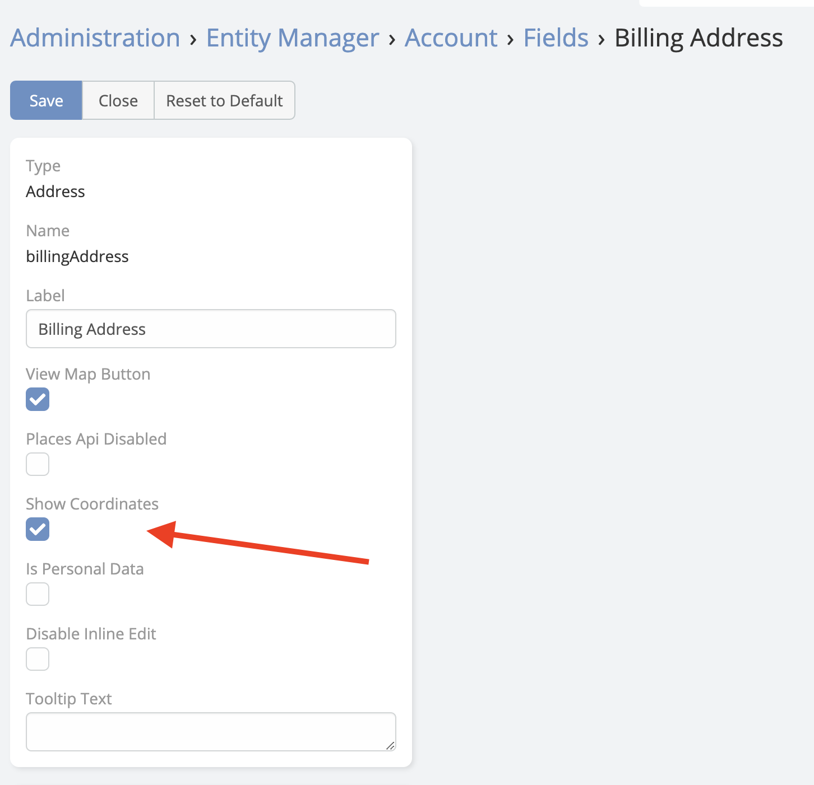

# Latitude and Longitude (Geocoding)

Ebla Map Plus extends every address field with latitude and longitude inputs. When a record is saved with a valid address, the extension automatically calls the Google Geocoding API and stores the coordinates — no manual action required.

---

## How Auto-Geocoding Works

When a record is saved:

1. The extension detects whether the address has changed since the last save.
2. If changed (and the address includes at least a city or postal code), a request is sent to the Google Geocoding API.
3. The returned coordinates are stored in the address field's `latitude` and `longitude` sub-fields.
4. Additional geocoding metadata (`geocodeType`, `addressData`) is also stored for reference.

Auto-geocoding is skipped in silent operations such as mass updates and imports. Use the [formula function](index.md#formula-function) to geocode after bulk data loads.

---

## Enable Latitude/Longitude on an Address Field

By default, the latitude and longitude inputs are hidden. Enable them per field in the Entity Manager:

1. Navigate to **Administration** → **Entity Manager**.
2. Select the entity type (e.g. Account).
3. Click **Fields**.
4. Find the address field (e.g. `billingAddress`) and click **Edit**.
5. Enable the **Latitude** and **Longitude** options.
6. Click **Save**.
7. Clear cache: **Administration** → **Clear Cache**.

!!! note
    Latitude and longitude values are stored as sub-fields of the address field. They appear in the edit and detail views when enabled, and are available in list layouts and formula.

---

## Manual Geocoding

If auto-geocoding did not run (e.g. after a bulk import), you can trigger geocoding manually:

- Open the record's edit view.
- Click **Get Coordinates** (or the map icon next to the address field).
- The extension calls the Geocoding API and fills in the coordinates.
- Save the record to persist the values.

---

## Disabling Auto-Geocode per Entity

To disable auto-geocoding on a specific entity type (while keeping geocoding available via formula):

- In the Entity Manager, edit the entity.
- Disable the **Auto Geocode** option.

---

## See Also

- [Place Search Autocomplete](search-place-autocomplete.md) — populate address fields and coordinates simultaneously
- [Map View](map-view.md) — display geocoded records on an interactive map
- [Formula Function](index.md#formula-function) — trigger geocoding from workflows
