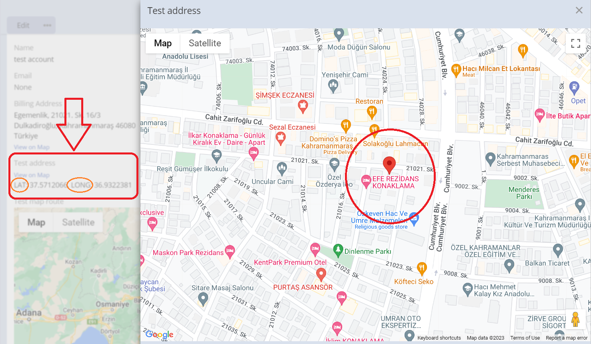
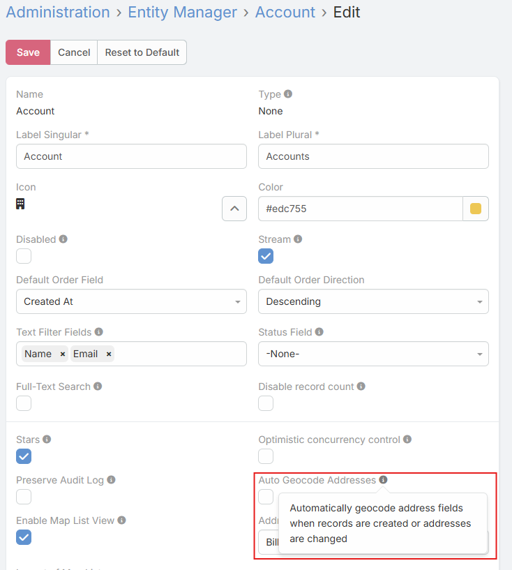
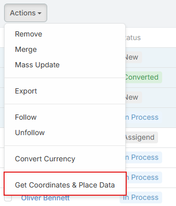
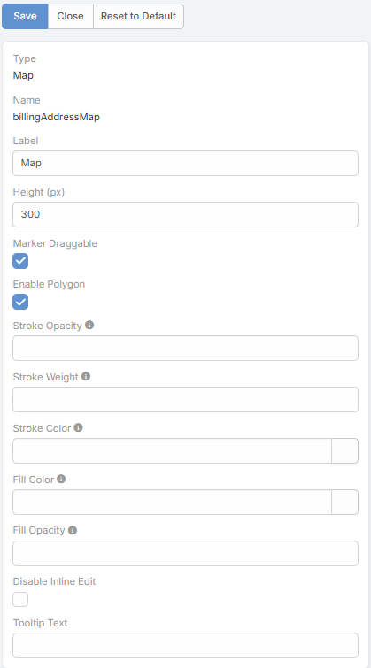
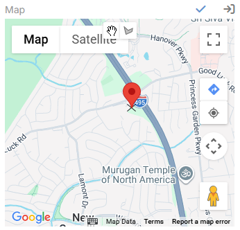

# Latitude and Longitude (Geocoding)

Ebla Map Plus extends standard EspoCRM address fields with geocoding-related sub-fields and actions. In addition to `latitude` and `longitude`, the extension stores raw geocode data and a geocode type value that indicates whether the result is exact or approximate.



---

## Stored Address Sub-Fields

Each enhanced address field can store these extra values:

| Sub-field      | Description |
|----------------| --- |
| `Latitude`     | Numeric latitude value. |
| `Longitude`    | Numeric longitude value. |
| `Geocode Type` | Indicates the quality of the result, such as `Exact` or `Approximate`. |

---

## How Auto-Geocoding Works

When auto-geocoding is enabled for an entity:

1. A new record or changed address triggers the geocode hook before save.
2. The extension checks every address field on the entity.
3. Geocoding runs when the field is new or when street, city, state, country, or postal code changes.
4. The request is skipped when the address does not contain at least a city or postal code.
5. The extension writes back `latitude`, `longitude` and `geocodeType`.

Auto-geocoding is skipped for silent save operations such as imports and some mass updates.

---

## Entity-Level Parameter

At the entity level, the extension adds:

| Parameter                | Description |
|--------------------------| --- |
| `Auto Geocode Addresses` | Automatically geocodes address fields when records are created or when address values change. |

Configure it in **Administration** -> **Entity Manager** -> open the entity -> **Edit**.


---

## Address Field Parameters

At the address field level, the extension adds:

| Parameter             | Description |
|-----------------------| --- |
| `Show Coordinates`    | Displays latitude and longitude inputs and shows coordinates in read mode. |
| `Geocode Button`      | Adds a button in read mode for manually fetching or refreshing geocoded data. |
| `Places Api Disabled` | Disables the Places-based autocomplete layer for that address field. |

---

## Mass Geocoding

List views for entities that contain at least one address field receive the **Get Coordinates & Place Data** mass action.

- Users can select multiple records and geocode them in one request.
- The action asks whether existing coordinate values should be overwritten or skipped.
- The backend geocodes all address fields on the selected records.


---

## Formula Function

Use the formula function when geocoding should be triggered from workflows or BPM scripts:

```text
ext\eblaMapPlus\geocode('billingAddress')
ext\eblaMapPlus\geocode('billingAddress', true)
```

The second argument forces an update even if coordinates already exist.

---

## Address Map Field Options

The address map view also includes additional map behavior that is not limited to plain coordinate storage:

| Parameter          | Description |
|--------------------| --- |
| `Marker Draggable` | Lets users drag the address marker in edit mode. After save, the extension can offer to update street, city, and state from the new marker position. |



Additional address map behaviors:

- Approximate geocode results are displayed as a circle instead of a precise marker.
- A **Directions** button opens Google Maps navigation to the address.
- A **Your Location** button can place the user's current position on the map.
- 

---

## See Also

- [Place Search Autocomplete](search-place-autocomplete.md)
- [Map View](map-view.md)
- [Map Route](map-route.md)
