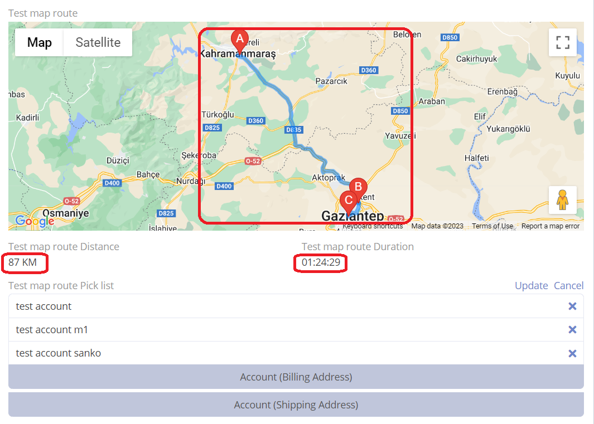
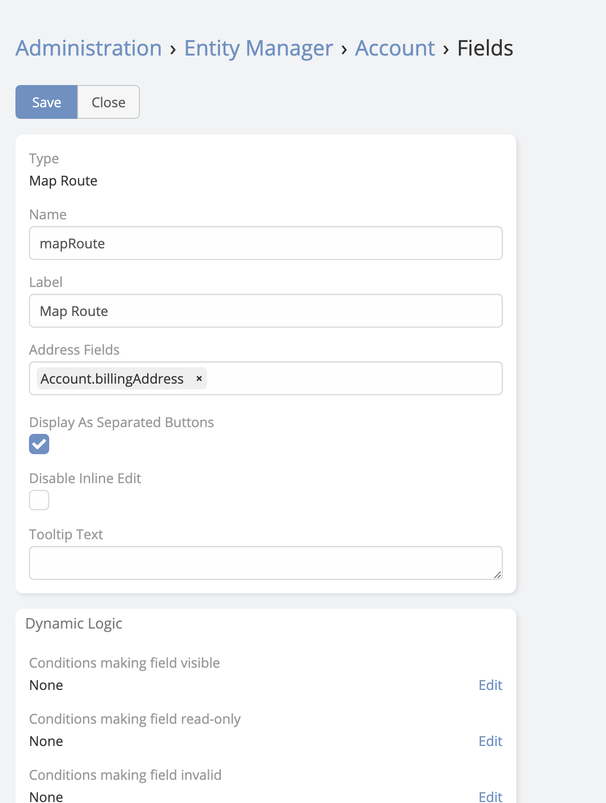

# Map Route

> The new **Map Route** field type allows users to plot a route on a map between two addresses fields in EspoCRM.
> Map Route is available in [Ebla Map Plus](https://www.eblasoft.com.tr/espocrm-extension-page/espocrm-map-extension).

<iframe width="650" height="315" src=" https://www.youtube.com/embed/gc3Sxb4rPWs" frameborder="0" allow="accelerometer; autoplay; clipboard-write; encrypted-media; gyroscope; picture-in-picture" allowfullscreen></iframe>

---

1. Go to **Administration** -> **Entity Manager** -> **{Entity Type}** -> **Fields** .
2. Create a new field with type **Map Route**.
3. Set **Address Field** to the field that contains the address.

