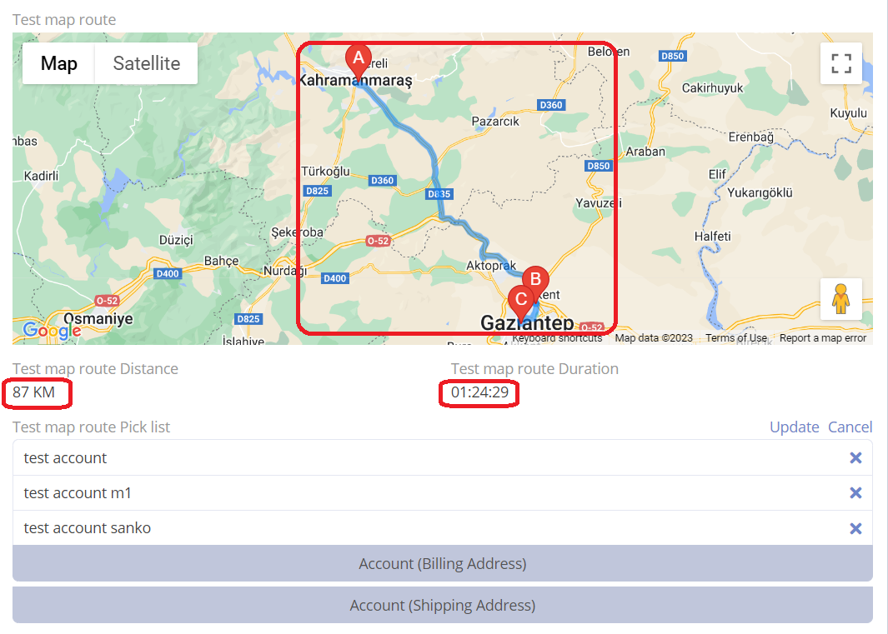
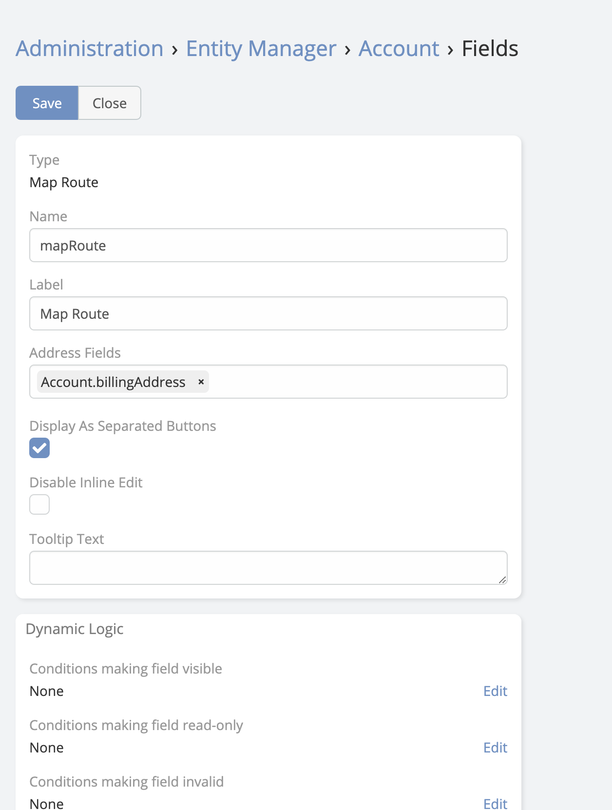

# Map Route

The **Map Route** field type plots a route between multiple address fields on a record and displays the calculated driving distance and estimated travel time. Route metrics are fetched from the Google Directions API and stored on the record.

<iframe width="650" height="315" src="https://www.youtube.com/embed/gc3Sxb4rPWs" frameborder="0" allow="accelerometer; autoplay; clipboard-write; encrypted-media; gyroscope; picture-in-picture" allowfullscreen></iframe>

---

## Prerequisites

- A valid Google Maps API key with the **Directions API** enabled.
- The address fields used as waypoints must have valid geocoded coordinates (see [Latitude and Longitude](latitude-and-longitude.md)).

---

## Adding a Map Route Field

1. Navigate to **Administration** → **Entity Manager**.
2. Select the entity type where you want to add routing (e.g. Account, Lead).
3. Click **Fields** → **Add Field**.
4. Set **Type** to **Map Route**.
5. Enter a **Name** and **Label** for the field (e.g. `routeToOffice` / "Route to Office").
6. In the **Address Field** setting, select the address field to use as the destination (e.g. `billingAddress`).
7. Click **Save**.
8. Add the new field to the entity's **Detail** and **Edit** layouts via **Layout Manager**.
9. Clear cache.

---

## Using Map Route

1. Open a record that has the Map Route field.
2. In the Map Route field panel, click **Add** to add waypoints.
3. Select address records (from Location or other entities) to add as stops.
4. The extension validates that each waypoint has latitude/longitude before adding.
5. Click **Calculate Route** (or save the record) to request directions from Google.
6. The field displays the total **distance** and **duration** for the calculated route.

!!! note
    Route metrics (distance and duration) are stored on the record after calculation. They are not recalculated automatically — click **Update Metrics** on the field to refresh after changing waypoints.

---

## Permissions

Access to update route metrics respects EspoCRM's ACL. Users need edit permission on the record to trigger a route calculation.

---

## See Also

- [Latitude and Longitude (Geocoding)](latitude-and-longitude.md) — required for route waypoints
- [Place Search Autocomplete](search-place-autocomplete.md) — quickly add address data with coordinates
- [Polygon Map](polygon-map.md) — draw geographic boundaries on a map field
