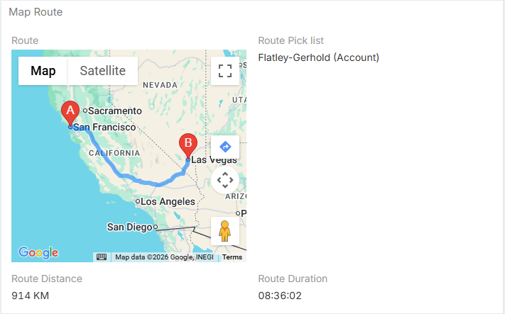
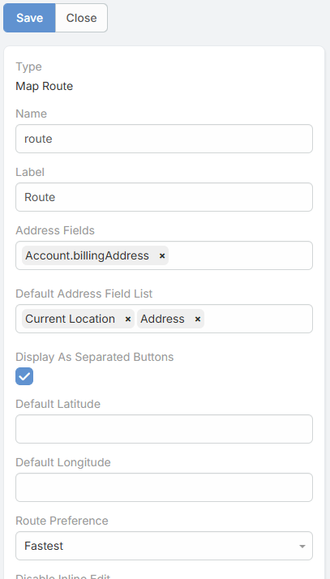
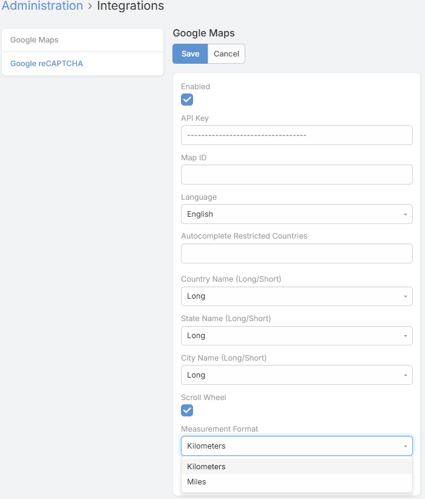

# Map Route

The **Map Route** field type plots a route between multiple points and stores the calculated **distance** and **duration** on the record. It is designed to work with local address fields, fixed coordinates, the user's current location, and manually selected related records.

<iframe width="650" height="315" src="https://www.youtube.com/embed/gc3Sxb4rPWs" frameborder="0" allow="accelerometer; autoplay; clipboard-write; encrypted-media; gyroscope; picture-in-picture" allowfullscreen></iframe>



---

## Generated Sub-Fields

Every **Map Route** field automatically creates these related fields:

| Sub-field | Description |
| --- | --- |
| `distance` | Stored route distance. Displayed in kilometers or miles according to the global measurement format setting. |
| `duration` | Stored route duration shown in `HH:MM:SS` format. |
| `pickList` | Internal list of manually selected route waypoints. |

---

## Field Parameters

The route field includes the following map-specific parameters:

| Parameter | Description |
| --- | --- |
| `addressFields` | Defines which address fields from any entity types can be selected manually as extra route waypoints. |
| `defaultAddressFieldList` | Adds local address fields from the current entity to the route automatically. Can also include `currentLocation`. |
| `displayAsSeparatedButtons` | Shows separate add buttons for configured address sources instead of a single generic add action. |
| `defaultLatitude` | Fixed default latitude that can act as a route point. |
| `defaultLongitude` | Fixed default longitude paired with `defaultLatitude`. |
| `routePreference` | Route mode: `Fastest` or `Shortest`. |


---

## How the Route Is Built

When the field renders, the route can be assembled from several sources in this order:

1. **Current Location**, when `currentLocation` is included in `defaultAddressFieldList`
2. **Fixed default coordinates**, when `defaultLatitude` and `defaultLongitude` are set
3. **Local address fields** from the current record, based on `defaultAddressFieldList`
4. **Manually selected related records** stored in `pickList`

If the final route has fewer than two valid points, no route is drawn.

---

## Selecting Additional Waypoints

The `addressFields` parameter lets you select addresses from multiple entity types. The add dialog shows entries in the format:

```text
EntityType.addressField
```

For each selected record:

- The chosen address field must contain latitude and longitude.
- Duplicate locations are prevented.
- The selected location is stored in the route `pickList`.

---

## Route Preferences

The `routePreference` parameter changes how Google directions are requested:

- **Fastest** uses driving options with live traffic-aware timing.
- **Shortest** optimizes waypoints and avoids ferries and tolls where possible.

The global **Measurement Format** integration setting controls whether route distance is shown in kilometers or miles.


---

## Map Actions

The route view includes extra controls beyond static route drawing:

- It recalculates automatically when the `pickList` changes.
- It writes changed `distance` and `duration` values back to the record through the extension API.
- It adds a **Directions** button that opens the current route in Google Maps navigation mode.

---

## Adding a Map Route Field

1. Navigate to **Administration** -> **Entity Manager**.
2. Select the entity type where you want to add routing.
3. Click **Fields** -> **Add Field**.
4. Set **Type** to **Map Route**.
5. Configure the route parameters described above.
6. Save the field.
7. Add the route field to the entity layout.

---

## Permissions

Users need edit access to the record for the extension to persist updated distance and duration values.

---

## See Also

- [Latitude and Longitude (Geocoding)](latitude-and-longitude.md)
- [Place Search Autocomplete](search-place-autocomplete.md)
- [Select on Map](select-on-map.md)
