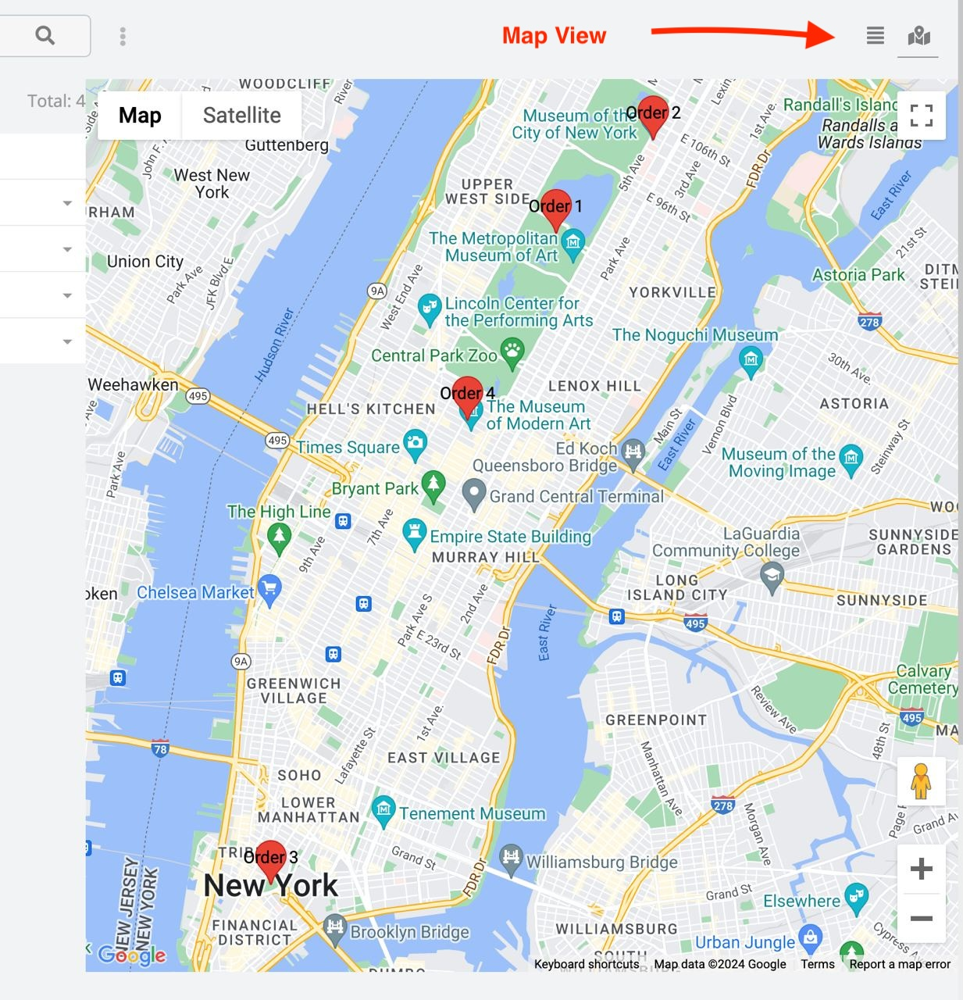
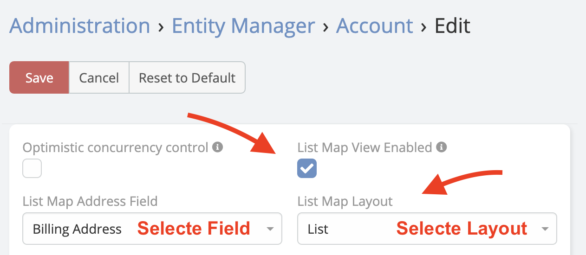

# Map View

Map View adds an interactive Google Map to the list view of any entity type. Records with geocoded addresses appear as clickable map pins. Clicking a pin opens the record's detail view.

---

## Prerequisites

- Ebla Map Plus installed and configured with a valid Google Maps API key.
- The target entity must have an address field with latitude/longitude enabled (see [Latitude and Longitude](latitude-and-longitude.md)).
- Records must have geocoded coordinates for pins to appear on the map.

---

## Enable Map View for an Entity

1. Navigate to **Administration** → **Entity Manager**.
2. Select the entity type (e.g. Account, Contact, Lead).
3. Click **Edit**.
4. Enable the **Map View** option.
5. Set the **Map Layout** field to the address field to use for pin placement (e.g. `billingAddress`).
6. Click **Save**.
7. Clear cache: **Administration** → **Clear Cache**.

!!! tip
    After enabling, a **Map** button or tab appears on the entity's list view. Use it to toggle between the standard list and the map display.

---

## Using Map View

1. Open the list view of the entity (e.g. **Accounts**).
2. Click the **Map** view toggle in the top-right of the list.
3. The map loads, displaying all records with valid coordinates as pins.
4. Click any pin to open a popup with the record name.
5. Click the record name in the popup to navigate to the detail view.

!!! note
    Records without geocoded addresses do not appear on the map. Run geocoding on existing records if pins are missing.

---

## See Also

- [Latitude and Longitude (Geocoding)](latitude-and-longitude.md) — enable coordinates on address fields
- [Place Search Autocomplete](search-place-autocomplete.md) — populate addresses faster
